# 《声印（VoiceMark）》软件需求规格说明书（SRS）

## 0 修订历史：

| 修改日期   | 说明     | 审核人员                  | 批准日期   |
| ---------- | -------- | ------------------------- | ---------- |
| 2025-11-28 | 初次编写 | 韩一墨 古振 易铭骏 赵泽远 | 2025-11-30 |
| 2025-12-13| 第二次编写| 韩一墨 古振 易铭骏 赵泽远 | 2025-12-15

# 1 引言（Introduction）

## 1.1 编写目的（Purpose）

本软件需求规格说明书（SRS）旨在：

* 为开发团队提供统一、明确、可执行的需求基础；
* 为测试团队提供测试用例编写依据；
* 为项目干系人（产品设计师、项目管理者）提供需求确认材料；
* 作为后续设计文档（架构、数据库设计、接口设计）的技术基础。

本 SRS 描述了“声印（VoiceMark）”系统的功能、数据结构、性能要求、安全要求及运行环境规范。

---

## 1.2 背景（Background）

**项目名称**：声印（VoiceMark）

**项目定位**：
一个支持语音记录、语音 AI 解读建议、地理位置标注、可视化统计、内容分享的多端记录类 Web 应用。

**项目目标**

* 让用户方便地录制语音记录并进行结构化管理；
* 使用大语言模型（LLM）提供即时内容辅助理解、情绪分析或主题归纳（仅实时生成，不存储）；
* 提供地图标注、时间线、数据统计等能力；
* 支持评论、点赞、收藏、热门推荐等社交元素；
* 支持跨平台使用（Web + Android）。

**主要用户痛点**

* 现有录音笔 App 记录混乱，没有结构化管理能力；
* 心情记录/语音日记缺少理解辅助，用户难以整理；
* 无法跨地点管理不同的语音片段；
* 缺乏社交互动，如点赞、评论、热门趋势；
* 普通笔记类产品不适合语音主导的交互。

**目标用户**

* 喜欢语音记录的普通用户；
* 进行采访、调研的工作者；
* 需要情绪记录、随记的用户；
* 对 LLM 解读有需求的人群。

**开发团队**

由xxx等四人小组组成的开发团队，每个人并行的开发各自负责的功能模块，并且负责与边缘功能涉及到的两个或多个其他模块的负责人对模块对接进行交流

---

## 1.3 参考资料（References）

* ISO/IEC/IEEE 29148-2018 《系统与软件需求工程》
* IEEE 830-1998 《软件需求规格说明》

---

## 1.4 假定与约束（Assumptions & Constraints）

**业务约束**

* LLM 返回内容不持久化，仅作为即时建议
* 用户音频存储走对象存储（阿里云 OSS / MinIO）
* 音频文件最大 20 MB

**团队约束**

* 前后端并行迭代开发
* 采用 Git + CI（GitHub Actions 或 GitLab CI）
* 线上沟通使用QQ或者微信群聊


**开发期限**
* 预计开发1个半月，从2025年11月中旬起，至2026年1月初结束

---

## 1.5 用户特点（User Characteristics）

**普通用户**

* 年龄 16–45 岁
* 习惯使用手机与 PC 记录内容
* 对语音识别、AI 解读有兴趣
* 熟悉基础 Web 或手机移动端操作

**系统维护人员**

* 熟悉微服务架构、容器化部署
* 熟悉 Java、SQL、Redis、日志监控系统
* 能管理音频存储与地图 API 配置

---

# 2 功能需求（Functional Requirements）

## 2.1 系统范围（System Scope）

声印系统包含以下主要功能：

1. **用户与认证模块**
2. **音频记录管理模块**
3. **标签管理模块**
4. **位置记录与地图模块**
5. **评论 & 点赞模块**
6. **热门推荐与内容流模块**
7. **数据统计与可视化模块**
8. **LLM 实时辅助模块（仅实时生成，不存储）**

系统通过前端 Vue3 Web 页面及 Android 打包 App 提供服务。
后端采用 Spring Boot 微服务：

* Auth Service
* User Service
* Audio Service
* Social Service（评论/点赞）
* Notification Service（热门推荐）
* Sse Service
* UserPersona Service
* LLM Service

---

## 2.2 系统总体流程（Overall System Flow）

**文本描述流程：**

1. 用户通过账号注册/登录进入系统
2. 进入主页，可浏览热门推荐内容
3. 创建语音记录
4. 用户可选择标签、位置信息、描述信息
5. 用户查看他人记录，可评论、点赞
6. 系统自动更新热门内容排序与推荐权重
7. 用户可以通过移动端查看附近记录（基于地理位置）

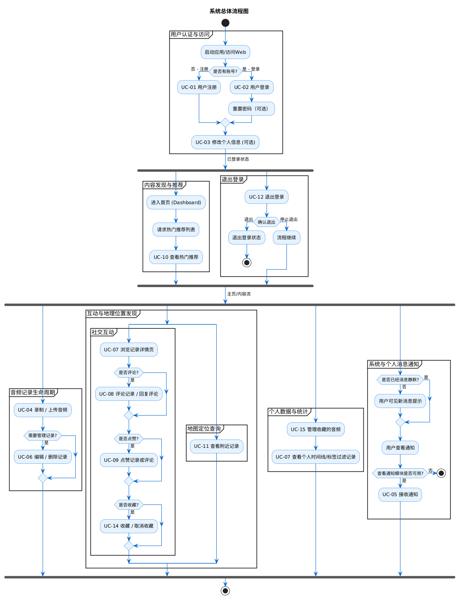

---

## 2.3 需求分析建模（Modeling）

---

### 2.3.1 功能建模（Use Cases）

下面列出系统内所有主要用例（覆盖目前需求范围）。

---

### **UC-01 用户注册（User Registration）**

**参与者：**
未注册用户

**前置条件：**
无

**后置条件：**
系统创建新的认证账号（AuthenticationAccount）与默认用户资料（UserProfile）

#### **基本流程：**

1. 用户打开注册页面。
2. 用户输入用户名、邮箱、手机号与密码。
3. 系统验证用户名长度、邮箱格式、手机号格式与密码合法性。
4. 系统检查用户名、邮箱、手机号是否已被使用。
5. 系统发送验证码邮件，用户手动验证。
6. 系统为用户创建 AuthenticationAccount。
7. 系统为新账号创建默认的 UserProfile。
8. 返回注册成功提示。

#### **异常流程：**

* 3a. 邮箱格式不合法 → 显示“邮箱格式错误”
* 3b. 手机号格式无效 → 显示“手机号格式错误”
* 3c. 密码不符合要求（过短/过弱） → 阻止提交，提示强度要求
* 3d. 用户名包含非法字符或长度超限 → 返回“用户名格式不正确”
* 4a. 邮箱已注册 → 返回“邮箱已被占用”
* 4b. 手机号已注册 → 返回“手机号已被占用”
* 4c. 用户名已存在 → 返回“用户名已被占用”
* 5a. 验证码未验证 → 流程暂停
* 6a. 创建 AuthenticationAccount 失败（数据库异常）
* 7a. 创建 UserProfile 失败 → 需要事务回滚
* 8a. 网络问题导致前端无法收到注册成功回执 → 允许用户刷新后查看登录状态

#### **泳道活动图**
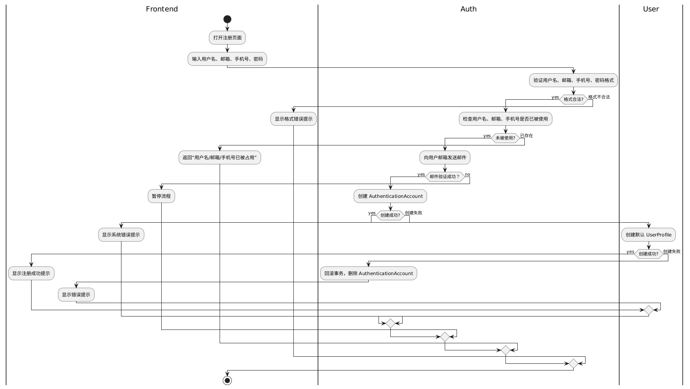

---

### **UC-02 用户登录 / JWT 认证（User Login）**

**参与者：**
已注册用户

**前置条件：**
已有有效账号

**后置条件：**
系统颁发 JWT（及可选的 Refresh Token）

#### **基本流程：**

1. 用户输入用户名/邮箱/手机号和密码。
2. 系统验证账号是否存在。
3. 系统比对密码哈希。
4. 验证通过后生成 JWT Token。
5. 用户成功登录，进入首页。

#### **分支事件流**：

* 找回密码：
1. 用户点击"忘记密码"。
2. 系统跳转至密码重置页面。
3. 用户输入邮箱/手机号申请重置。
4. 系统发送验证码或重置链接。
5. 用户验证身份后设置新密码。

#### **异常流程：**

* 2a. 账号不存在 → 返回“账号不存在”
* 3a. 密码错误 → 返回“密码不正确”
* 3b. 密码输错次数过多 → 锁定账号 X 分钟
* 4a. Token 生成失败（加密模块异常） → 返回“无法登录，请稍后重试”
* 4b. Redis/会话服务不可用 → 返回“系统繁忙”
* 5a. 账号被封禁 → 阻止登录
* 分支3a. 找回密码的账户不存在 → 提示“账户不存在”
* 分支5a. 验证码过期 → 提示“验证码已过期”

#### **泳道活动图**

* 基本流程

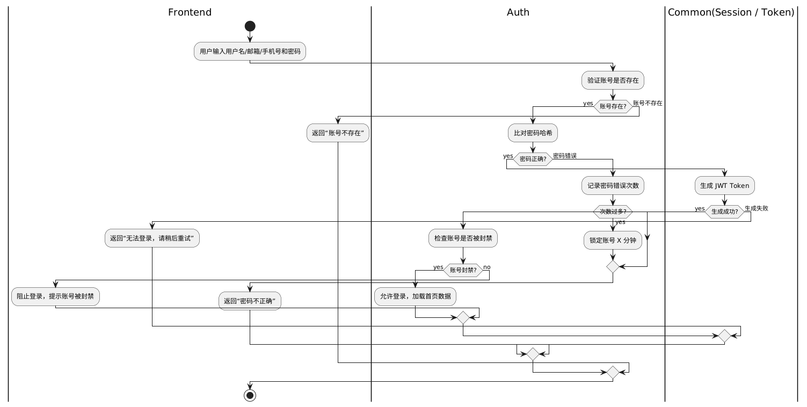

* 分支流程

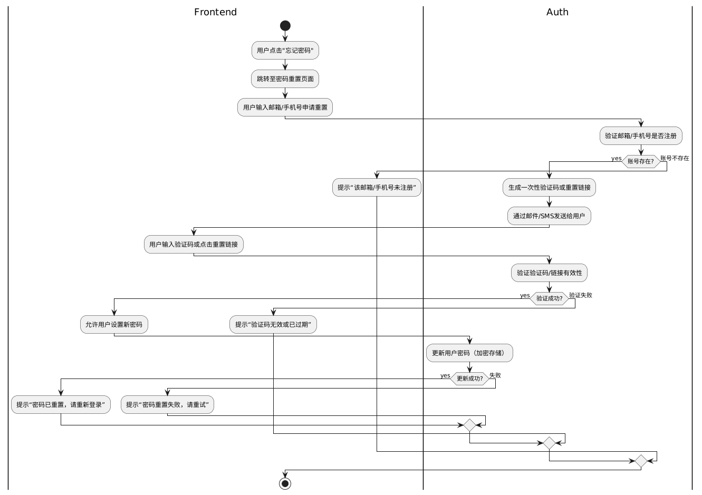


---

### **UC-03 修改个人信息（Edit Profile）**

**参与者：**
用户

**前置条件：**
用户已登录

**后置条件：**
UserProfile 更新成功

#### **基本流程：**

1. 用户打开“个人资料”页面。
2. 用户编辑头像、昵称、简介等信息。
3. 用户提交修改。
4. 系统保存新数据，返回成功并向用户推送通知。

#### **异常流程：**

* 2a. 上传头像失败（格式/大小超限） → 返回“头像上传失败”
* 2b. 昵称含非法字符或超长 → 阻止保存
* 2c. 简介超字数限制 → 返回错误提示
* 3a. 用户 Token 过期 → 拦截并要求重新登录
* 3b. 用户资料被锁定（封禁状态） → 无法修改
* 4b. 更新数据库失败 → 返回“保存失败，请重试”


#### **泳道活动图**

* 基本流程

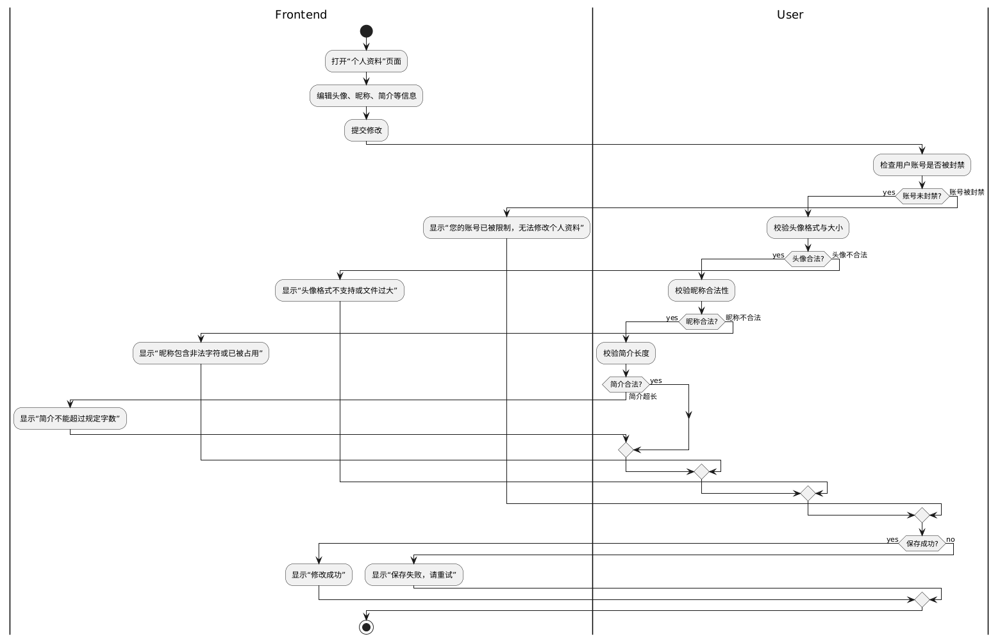

---

### **UC-04 录制音频 / 上传音频（Record or Upload Audio）**

**参与者：**
用户

**前置条件：**
用户已登录

**后置条件：**
音频文件上传成功并存储在对象存储中（未形成 AudioRecord 结构）。

#### **基本流程：**

1. 用户点击“录音/上传”按钮。
2. 系统请求地理位置定位权限
3. 用户填写标题、描述。
4. 用户可选择标签（多个）。
5. 用户可请求 LLM 生成音频建议（实时，不存储）。
6. 若录音模式，则系统请求麦克风权限并开始录音。
7. 用户停止录音。
8. 用户提交音频记录。
9. 前端上传记录到后端服务。

#### **扩展流程：**

* 录音结束后用户可继续：
  * 试听音频
  * 删除重新录制

#### **异常流程：**

* 2a. 用户拒绝 GPS 定位授权 → 拒绝用户录音或者上传音频
* 5a. LLM 请求失败 / 网络波动 → 返回“无法获取建议”
* 6a. 用户拒绝麦克风权限 → 无法录音，只能上传本地文件
* 6b. 录音过程中断（系统权限变更或浏览器中断）
* 8a. 上传记录失败（网络断开 / 文件过大 / 格式不支持）
* 8b. 提交时用户 Token 过期 → 强制重新登录
* 9a. 后端解析失败 → 返回“音频无法上传”
* 9b. 数据库存储失败 → 创建失败

#### **泳道活动图**
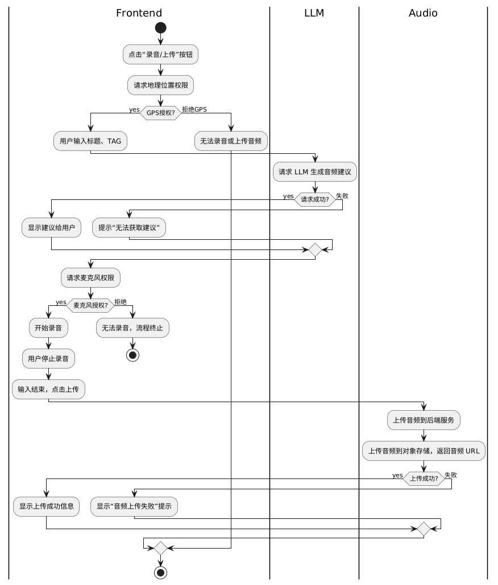

---

### **UC-05 接收通知（Receive Notifications）**

**参与者**
1. 用户、管理员

**前置条件**
1. 用户已登录；有待处理的系统通知

**后置条件**
1. 用户查看系统通知，通知状态更新为已读

#### **基本流程**

1. 系统检测到有待发送的通知（如系统维护公告）。
2. 系统在用户页面右上角显示通知红点提示。
3. 用户点击通知图标进入通知中心。
4. 系统显示未读通知列表。
5. 用户点击某条通知查看详情。
6. 系统显示完整的通知内容及相关操作选项。
7. 系统将该通知标记为已读状态。

#### **分支事件流**

1. 批量处理通知：用户可批量标记通知为已读，或一键清空所有已读通知。
2. 通知静默：用户进入通知界面，选择"通知静默"，此后将不再提示有未读通知（红点消失）。

#### **异常流程**

* 4a. 通知内容异常 → 显示"通知内容暂不可用"
* 4b. 网络连接中断 → 提示"网络连接异常，通知同步暂停"
* 4c. 通知加载失败 → 提示"通知加载失败，请刷新页面重试"
* 6a. 音频详情加载失败 → 提示"音频加载失败，请刷新页面重试"

#### **泳道活动图**

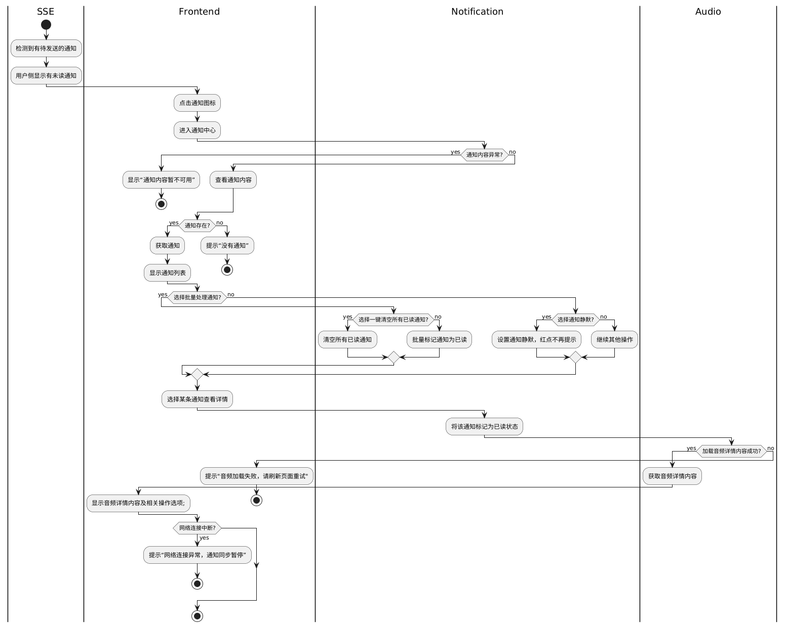

---


### **UC-06 编辑 / 删除音频记录（Edit/Delete AudioRecord）**

**参与者：**
用户

**前置条件：**
用户是该记录的创建者

**后置条件：**
记录更新或删除

#### **基本流程：**

1. 用户进入自己创建的记录详情页。
2. 用户修改标题、描述。
3. 系统保存变更。

#### **异常流程：**

* 1a. 记录不存在 / 被删除 → 提示无法编辑
* 2a. 标题为空 → 阻止保存
* 2b. 标签非法或超过数量限制
* 3a. 保存失败（数据库异常）
* 3b. 用户非记录拥有者 → 权限拒绝

#### **删除基本流程：**

1. 用户点击“删除记录”。
2. 系统执行软删除/硬删除（按系统策略）。

#### **删除异常流程：**

* 1a. 用户尝试删除不属于自己的记录 → 返回“无权限”
* 2a. 删除过程中数据库失败 → 返回“删除失败”
* 2b. 记录已被删除（重复操作） → 返回提示

#### **泳道活动图**
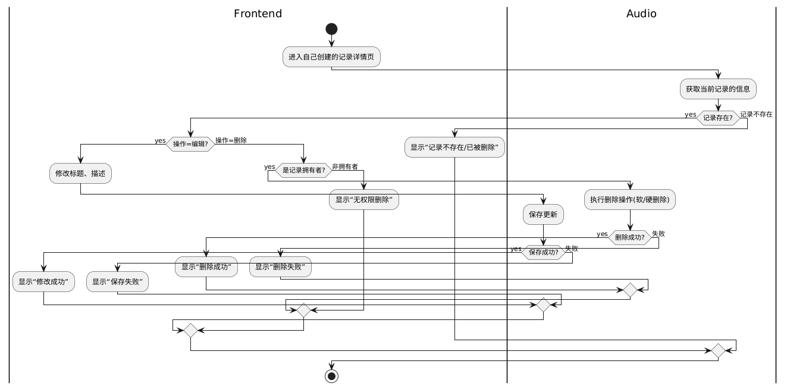

---

### **UC-07 浏览记录（浏览自己的/他人的记录）**

**参与者：**
用户

**前置条件：**
无

**后置条件：**
无

#### **基本流程：**

1. 用户访问首页、时间线页、标签页或地图页。
2. 系统加载满足筛选条件的记录列表：

   * 按时间排序
   * 按标签过滤
   * 按地理位置筛选
3. 用户选择某条记录进入详情页。
4. 系统展示音频、文本、标签、位置、评论、点赞等。

#### **异常流程：**

* 1a. 网络异常导致记录列表加载失败
* 2a. 筛选条件非法（如标签不存在）
* 3a. 记录不存在或改为私密或被封禁 → 返回“内容不可用”
* 4a. 音频文件 URL 失效 → 无法播放

#### **泳道活动图**
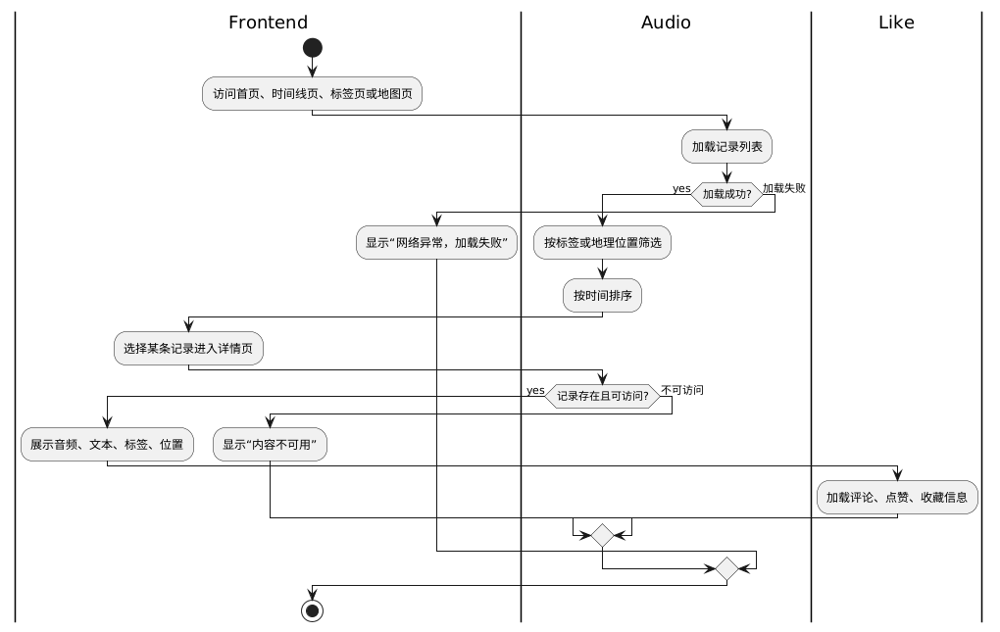

---

### **UC-08 评论记录 / 回复评论（Comment and Reply）**

**参与者：**
用户

**前置条件：**
用户已登录

**后置条件：**
新增 Comment 实例

#### **基本流程：**

1. 用户在音频记录详情页输入评论内容。
2. 用户可选择回复另一条评论（ParentCommentId）。
3. 系统保存评论内容并返回成功。

#### **异常流程：**

* 1a. 内容为空 → 提示“评论不能为空”
* 1b. 内容过长 → 提示“字数超限”
* 1c. 记录不存在或被删除 → 禁止评论
* 2a. 回复目标评论不存在 → 拒绝发送
* 3a. 存储失败 → 返回错误信息

#### **泳道活动图**
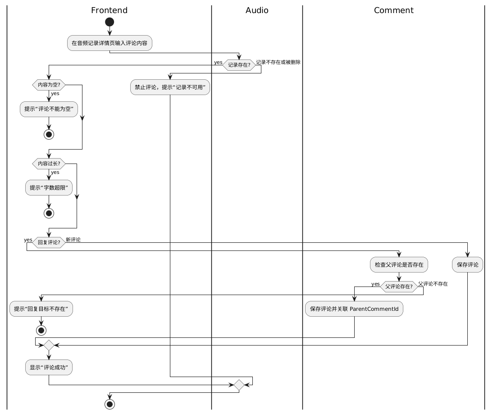

---

### **UC-09 点赞记录或评论（Like Content）**

**参与者：**
用户

**前置条件：**
用户已登录

**后置条件：**
新增或删除 Like 实例

#### **基本流程：**

1. 用户点击“点赞”按钮：

   * 若未点赞 → 新增 Like
   * 若已点赞 → 取消 Like
2. 系统更新目标对象（Record 或 Comment）的点赞计数。

#### **异常流程：**

* 1a. 用户未登录 → 请求被拒绝
* 1b. 点赞目标不存在（记录/评论已删除）
* 1c. 重复点赞（同一用户已点过赞） → 不允许重复创建
* 2a. 点赞记录写入失败（数据库、Redis 错误）

#### **泳道活动图**


---

### **UC-10 查看热门推荐（Browse Hot Recommendations）**

**参与者：**
用户

**前置条件：**
无

**后置条件：**
无

#### **基本流程：**

1. 用户打开首页“热门推荐”模块。
2. 系统从 Audio Service 获取排序后的热门列表：

   * 点赞数
   * 评论数
   * 播放量
   * 时间衰减系数
3. 返回热门记录列表。

#### **分支事件流：**

1. 用户打开“大模型推荐”模块
2. 用户使用自然语言输入想查找的记录
3. 大模型返回查找的记录列表

#### **异常流程：**

* 1a. 推荐服务不可用 → 返回空列表+降级提示
* 2a. 推荐算法超时 → 使用缓存旧榜单
* 3a. 用户网络异常 → 前端展示加载失败
* 3b. 推荐记录中包含已删除内容 → 自动过滤该条
* 分支2a. 大模型服务不可用 → 显示“大模型服务不可用”

#### **泳道活动图**
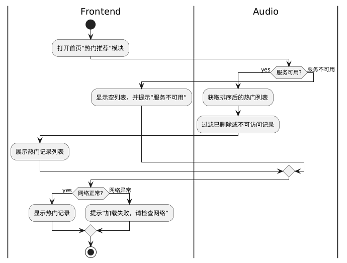

---

### **UC-11 查看附近记录（Nearby Records on Map）**

**参与者：**
用户

**前置条件：**
用户已为前端授权提供 GPS 定位

**后置条件：**
无

#### **基本流程：**

1. 用户进入地图界面。
2. 系统请求当前 GPS 坐标。
3. 系统查询半径范围内的记录（如 200m/500m）。
4. 系统在地图上展示附近的记录点。
5. 用户点击某个点查看详情。

#### **异常流程：**

* 1a. 用户拒绝定位权限 → 无法加载“附近”模块
* 2a. 定位失败（GPS 信号弱） → 显示提示
* 3a. 地图 API 服务不可用 → 地图加载失败
* 4a. 附近无记录 → 展示空列表(地图上无记录点)
* 5a. 某些记录位置数据损坏 → 提示该记录不可用

#### **泳道活动图**
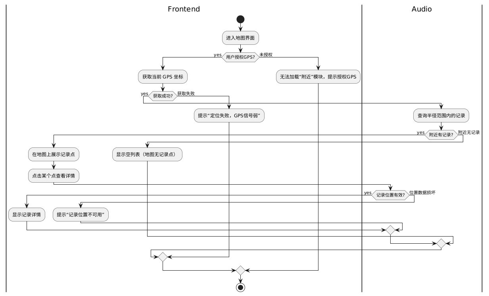

---


### **UC-12 退出登录（Logout）**

**参与者** 
1. 用户、管理员

**前置条件** 
1. 用户已登录

**后置条件** 
1. 用户登出系统，清除本地登录状态

#### **基本流程**

1. 用户鼠标点击页面右上角头像。
2. 用户跳转到个人信息页面
3. 用户点击"退出登录"。
4. 系统弹出确认对话框。
5. 用户确认退出。
6. 系统清除客户端存储的JWT Token及用户状态。
7. 系统跳转回未登录状态的主页。

#### **分支事件流**
* 取消退出：用户在确认对话框选择“取消”，保持登录状态

#### **异常流程**
* 6a. 退出时发生网络错误 → 系统仍清除本地数据。显示“已退出登录”

#### **泳道活动图**

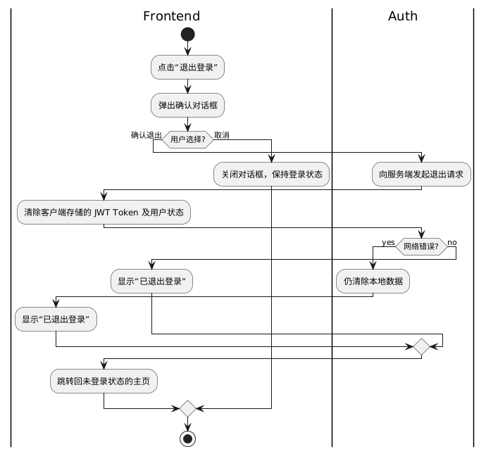

---

### **UC-13 LLM 实时推荐（LLM Suggestion）**

**参与者：**
用户

**前置条件：**
用户已登录

**后置条件：**
无（不存储返回结果）

#### **基本流程：**

1. 用户在发现页面点击“AI推荐”。
2. 后端调用 LLM API 获取针对该用户的智能推荐。
3. 系统返回结果供用户参考。

#### **异常流程：**

* 2a. LLM API 超时 → 返回“AI 服务繁忙”
* 2b. LLM API 错误（429 限流） → 显示“今日请求次数过多”
* 2c. 网络异常 → 无法调用 LLM 服务
* 3a. 返回内容为空 → 返回“无法生成结果”

#### **泳道活动图**
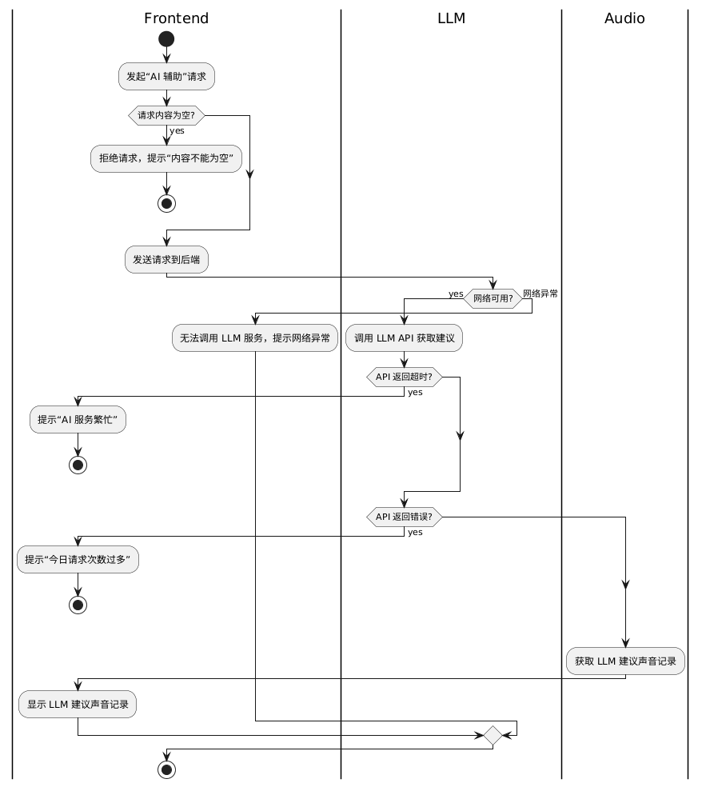

---

### **UC-14 收藏 / 取消收藏音频（Favorite / Unfavorite Audio）**

**参与者** 
普通用户（登录状态）

**前置条件**
1. 用户已登录。
2. 音频记录真实存在并可访问。
3. 用户可以收藏自己的或别人的音频。

**后置条件**
1. 收藏状态（收藏 / 未收藏）成功更新。
2. 收藏记录可能用于个性化推荐（如有）。

#### **基本流程**

1. 用户在音频详情页点击“收藏”按钮。
2. 系统检查是否已有收藏记录。
3. 如果用户未收藏 → 系统新增一条收藏记录。
4. 如果用户已收藏 → 系统删除该收藏记录，变为“取消收藏”。
5. 系统更新 UI 状态（变成“已收藏”或“收藏”）。

#### **异常流程**

* 1a. 音频不存在或已删除 → 提示“音频不可用”。
* 数据库写入/删除失败 → 提示“操作失败，请稍后再试”。

#### **泳道活动图**
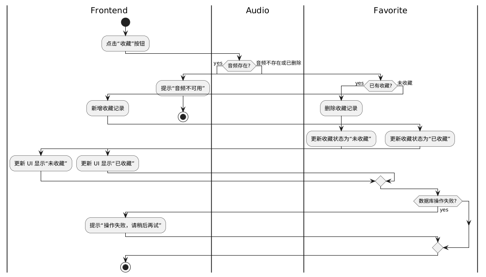

---

### **UC-15 管理收藏的音频（Manage Favorite Audios）**

**参与者** 
普通用户（登录）

**前置条件** 
用户至少收藏了一个音频。

**后置条件**
用户的收藏列表更新。

#### **基本流程**

1. 用户进入“我的收藏”页面。
2. 系统加载用户所有收藏记录，并按收藏时间排序。
3. 用户在列表中可以执行以下操作：

   * **取消收藏**
   * **查看音频详情**
4. 系统实时更新收藏列表（如某项被取消收藏）。

#### **异常流程**

* 1a. 该音频已被删除或禁用 → 列表中标记为“失效音频”，并允许用户移除。
* 2a. 获取收藏列表失败 → 提示错误。

#### **泳道活动图**
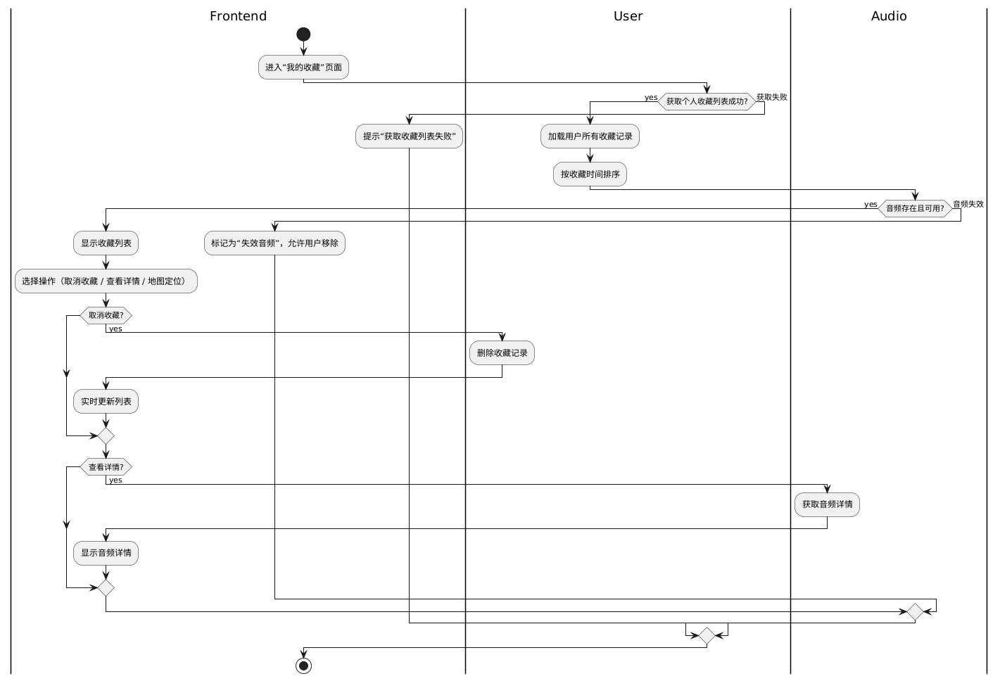

---


## 2.3.2 数据建模（Data Modeling）

### 实体关系图


---

### 核心数据类列表

#### **AuthenticationAccount（认证账号）**
用于用户登录认证，保证系统识别唯一用户身份,存储用户登录相关信息，如用户名、邮箱、手机号和密码哈希

* UserId 主键，唯一标识一个用户账号，与 UserProfile 一对一。
* UserName 登录名称，必须唯一。
* Email 用户邮箱，用于登录和通知，唯一。
* PhoneNumber 用户手机号，用于登录或找回密码，唯一。
* PasswordHash 使用安全算法加密后的密码。
* RegisterTime 用户账号创建时间。

关系：

* 与 UserProfile 一对一关联（UserId 作为外键）
* 与 AudioRecord、Comment、Like、Favorite 间接关联，通过 UserId 表示操作或所有者

#### **UserProfile（个人信息）**
存储用户可编辑的个人信息，用于展示用户资料,与前端用户界面绑定，用于显示昵称、头像、简介等

* UserId 主键，与 AuthenticationAccount.UserId 相同。
* Nickname 用户昵称，用于展示
* AvatarUrl 用户头像地址。
* Bio 个人简介（短文本）。
* SelfDescription 更详细的个性描述（长文本）。

关系：

* 与 AuthenticationAccount 一对一
* 与 AudioRecord、Comment、Favorite 等一对多关系，表示用户创建的音频、评论及收藏

---

#### **AudioRecord**
存储用户上传或录制的音频文件及相关信息,支持关联位置、标签、评论、点赞、收藏

* RecordId 主键，唯一标识一条音频记录。
* UserId 上传该音频的用户Id。
* Title 音频标题。
* Description 音频的补充描述信息。
* AudioUrl 音频文件在对象存储中的访问地址。
* TranscriptText 音频转文本内容（如有语音识别模块）。
* Latitude 音频录制地点的纬度。
* Longitude 音频录制地点的经度。
* CreatedTime 记录创建时间。
* UpdatedTime 最近修改时间。

关系：

* 与 UserProfile 一对多（UserId）——创建者
* 与 Tag 多对多，通过 RecordTag 关联
* 与 Comment 一对多（RecordId）——评论所属记录
* 与 Like 一对多（TargetType=RECORD）——音频点赞
* 与 Favorite 一对多（RecordId）——用户收藏

---

#### **Tag**
对音频记录进行分类和标记，支持筛选与搜索,支持用户自定义标签或系统推荐标签

* Name 标签名称，如“自然声”“城市环境”等。
* RecordId 指向一条音频记录。

关系：

* 与 AudioRecord 多对多
* 不直接与用户关联，关联行为通过 Tag 和 AudioRecord 间接体现

---

#### **Comment**
用户对音频记录的评论，可支持回复其他评论形成多级评论,用于互动模块，如点赞、通知

* CommentId 主键，唯一标识一条评论。
* RecordId 评论所属的音频记录。
* UserId 评论者用户。
* ParentCommentId (nullable) 父级评论 ID，为空时表示一级评论。
* Content 评论内容文本。
* CreatedTime 评论的发布时间。

关系：

* RecordId → AudioRecord.RecordId
* UserId → UserProfile.UserId（评论者）
* ParentCommentId → Comment.CommentId（父评论，用于多级嵌套）
* 与 Like 一对多关系（TargetType=COMMENT）——评论点赞

---

#### **Like**
用户对音频或评论的点赞行为记录,支持计算热门推荐、互动统计

* LikeId 主键，唯一标识一条点赞记录。
* UserId 点赞的用户。
* TargetType（Enum: RECORD / COMMENT） 枚举：RECORD / COMMENT，用于区分点赞对象类型。
* TargetId 对应的 RecordId 或 CommentId。

关系：

* UserId → UserProfile.UserId（点赞者）
* TargetType + TargetId → AudioRecord.RecordId 或 Comment.CommentId
* 通过 TargetId 与目标对象绑定

---

#### **Favorite**
用户收藏音频记录, 支持查看收藏列表、跳转至地图展示音频地点

* FavoriteId 主键，唯一标识一条收藏行为。
* UserId 收藏者用户。
* RecordId 被收藏的音频记录 ID。
* CreatedAt 收藏时间。

关系：

* UserId → UserProfile.UserId（收藏者）
* RecordId → AudioRecord.RecordId（被收藏记录）

#### **Notification**  
用户接收系统或他人互动产生的通知，支持按类型分类查看、标记已读/未读，并可跳转至关联的音频记录或评论。

* id 主键，唯一标识一条通知。  
* actorUserId 触发通知的用户 ID（如点赞、评论的用户）。  
* receiverUserId 接收通知的用户 ID。  
* type 通知类型（如“新评论”、“被点赞”、“被收藏”等）。  
* targetId 通知所指向的目标对象 ID（如音频记录 ID 或评论 ID）。  
* targetType 目标类型，枚举值（如 RECORD 表示音频记录，COMMENT 表示评论）。  
* eventId 唯一事件 ID，用于去重或幂等处理。  
* content 通知内容摘要，用于前端展示（如“张三评论了你的音频”）。  
* createdAt 通知创建时间。  
* isRead 是否已读，用于控制未读红点等交互状态。

关系：

* actorUserId\receiverId → UserProfile.UserId
* targetId → Favorite.FavoriteId\Comment.CommentId\Like.LikeId
---

#### 类图

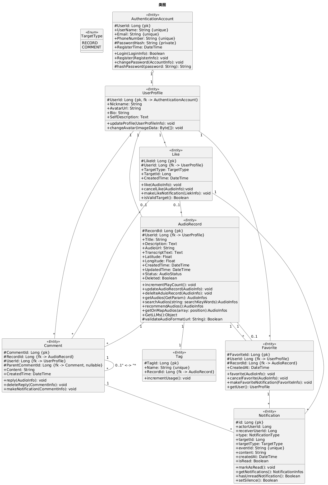

---

## 2.3.3 行为建模（Behavior Modeling）

### **2.3.3.1 状态图（State Machine Descriptions）**

#### **（1）用户状态（User）**

**描述：**
用户对象在系统中的状态主要包括：

1. **未注册（Unregistered）**：用户尚未创建账户，可访问注册页面。
2. **已注册（Registered）**：账户已创建，但未登录状态。
3. **已登录（Logged In）**：用户已验证身份，可执行系统所有操作。
4. **已登出（Logged Out）**：用户主动退出登录后的状态。
5. **账号被封禁/禁用（Suspended/Disabled）**：账户因违规或系统限制被禁止使用。

**状态转移逻辑：**

* 未注册 → 注册成功 → 已注册
* 已注册 → 登录成功 → 已登录
* 已登录 → 用户主动退出 → 已登出
* 已注册/已登录 → 系统封禁 → 禁用
* 禁用 → 系统解封 → 已注册或已登录

**说明：**
用户状态决定可操作的系统功能，如登录状态才能创建音频记录、评论、点赞、收藏等。

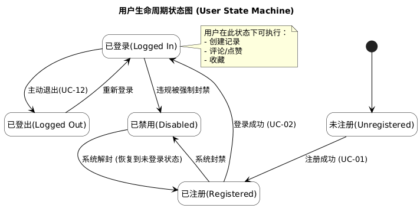

---

#### **（2）音频记录状态（AudioRecord）**

**描述：**
音频记录对象状态反映用户录制和管理音频的生命周期：

1. **待上传（Pending Upload）**：用户准备录音或选择文件。
2. **已上传（Uploaded）**：音频文件已成功上传至对象存储。
3. **已创建（Created / Persisted）**：AudioRecord 实例在数据库中创建完成。
4. **编辑中（Editing）**：用户正在修改音频记录信息。
5. **已删除（Deleted）**：记录被用户删除（软/硬删除）。

**状态转移逻辑：**

* 待上传 → 上传成功 → 已上传
* 已上传 → 创建记录 → 已创建
* 已创建 → 编辑 → 编辑中 → 保存 → 已创建
* 已创建 → 删除 → 已删除

**说明：**
该状态图用于管理音频记录创建、编辑和删除的完整流程。

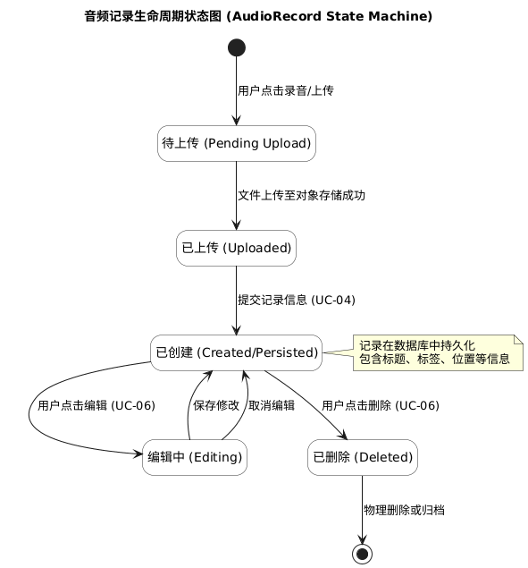

---

#### **（3）评论状态（Comment）**

**描述：**
评论对象的生命周期：

1. **草稿（Draft）**：用户正在输入或编辑评论内容。
2. **已发布（Posted）**：评论成功提交到系统，其他用户可见。
3. **已删除（Deleted）**：评论被用户或管理员删除。

**状态转移逻辑：**

* 草稿 → 提交 → 已发布
* 已发布 → 删除 → 已删除

**说明：**
支持多级评论结构（ParentCommentId），状态变化影响展示与操作权限。

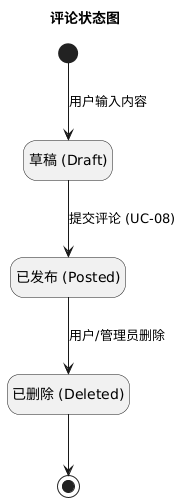

---

#### **（4）收藏状态（Favorite）**

**描述：**
收藏对象状态：

1. **未收藏（Not Favorited）**：用户尚未收藏该音频。
2. **已收藏（Favorited）**：用户已收藏音频，可在收藏列表查看。

**状态转移逻辑：**

* 未收藏 → 用户收藏 → 已收藏
* 已收藏 → 用户取消收藏 → 未收藏

**说明：**
收藏状态与音频记录关联，用于个人收藏管理及跳转到地图对应音频位置。

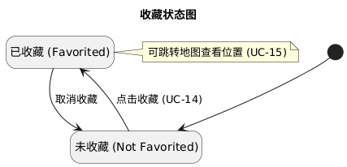

---

### **2.3.3.2 时序图（Sequence Diagrams Descriptions）**

#### **（1）用户注册与登录**

**描述：**

* **对象：** User / AuthenticationAccount / UserProfile / Frontend / Backend

* **注册流程：**

  1. 用户提交注册信息（用户名、邮箱、手机号、密码）。
  2. 前端验证格式 → 后端检查唯一性。
  3. 后端创建 AuthenticationAccount 和 UserProfile。
  4. 返回注册成功提示。

* **登录流程：**

  1. 用户输入账号密码并提交。
  2. 后端验证账号及密码哈希。
  3. 验证通过 → 生成 JWT Token 返回前端。
  4. 前端保存 Token，用户进入系统。

**说明：**
确保用户身份验证与授权流程安全可靠。

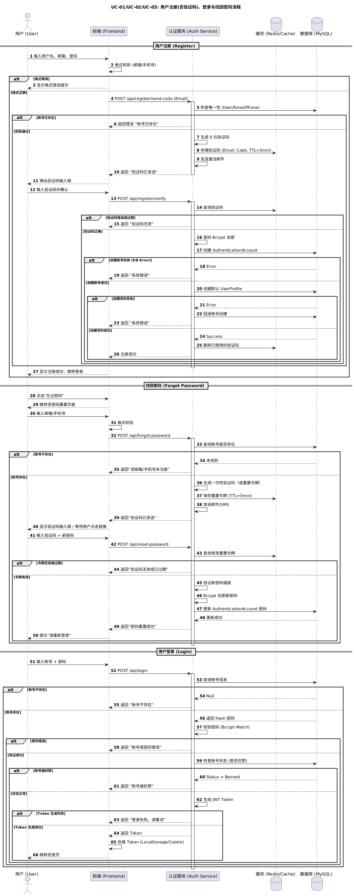

---

#### **（2）音频录制与上传**

**描述：**

* **对象：** User / AudioRecord / Frontend / Backend / ObjectStorage / LLM Service
* **流程：**

  1. 用户点击录音/上传 → 前端请求权限。
  2. 用户录制音频 → 上传到后端。
  3. 后端创建 AudioRecord → 后端保存，包括标签、位置等信息。
  4. 可选择调用 LLM 生成实时建议（不存储）。

**说明：**
确保音频与位置绑定，并提供 AI 辅助建议。

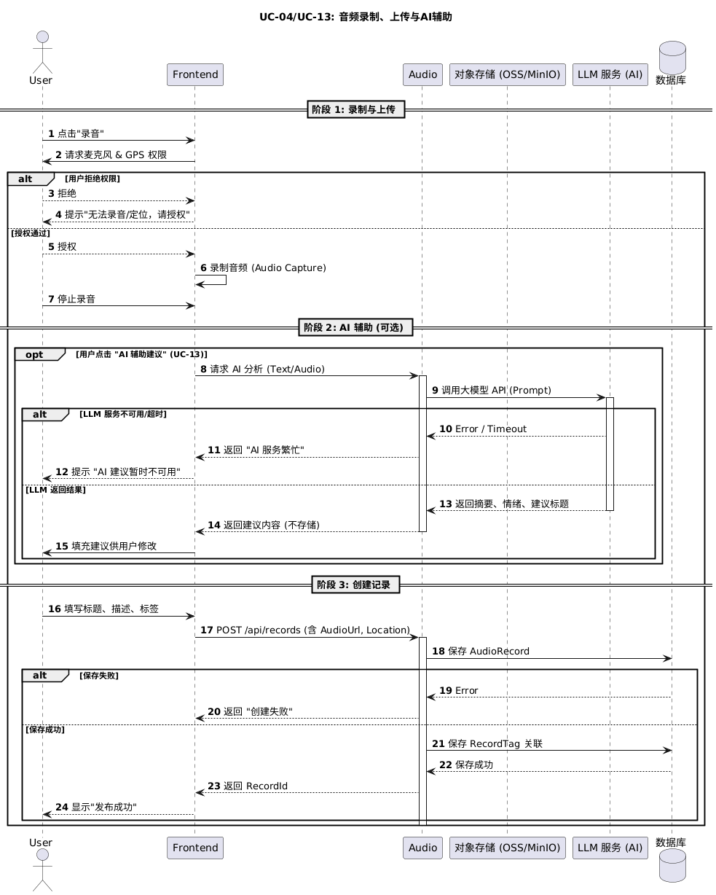

---

#### **（3）评论、点赞、收藏操作**

**描述：**

* **对象：** User / AudioRecord / Comment / Like / Favorite / Backend

* **评论：**

  1. 用户输入评论并提交 → 后端创建 Comment。
  2. 返回成功 → 前端刷新评论列表。
     *异常情况：* 内容为空、记录不存在 → 返回提示。

* **点赞：**

  1. 用户点击点赞 → 后端判断是否已点赞 → 新增/删除 Like。
  2. 返回结果 → 更新前端点赞计数。

* **收藏：**

  1. 用户点击收藏 → 后端新增/删除 Favorite。
  2. 返回成功 → 前端更新收藏状态。
  3. 用户可在收藏列表中查看音频，并跳转到地图位置。

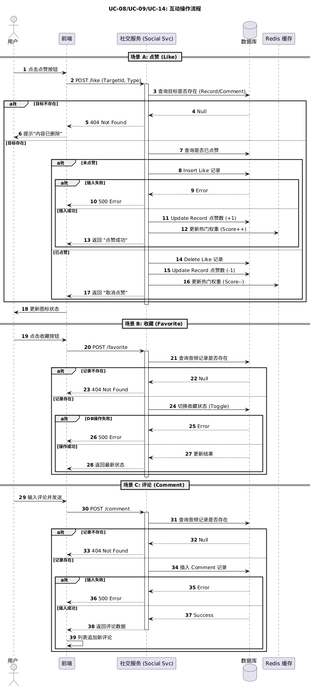

---

#### **（4）热门推荐生成**

**描述：**

* **对象：** User / AudioService / Backend / Frontend
* **流程：**

  1. 用户打开首页热门推荐。
  2. 前端请求 AudioService 获取排序列表。
  3. 后端根据点赞、评论、播放量、时间衰减生成推荐列表。
  4. 返回前端 → 渲染音频信息（封面、标签、位置等）。

**说明：**
支持首页热门推荐模块的动态内容展示。

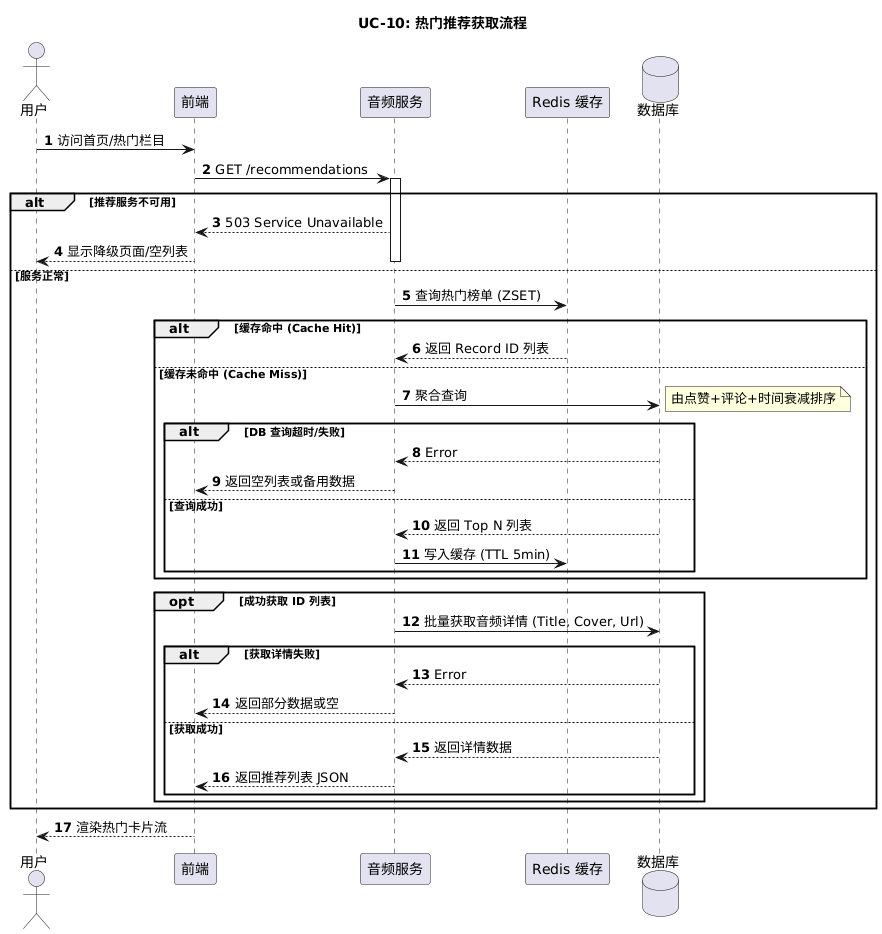

---

#### **（5）音频记录管理**

**描述：**

* **对象：** User / AudioRecord / RecordTag / Backend / Frontend
* **流程：**

  1. 用户在个人页面选择记录进行编辑或删除。
  2. **编辑：** 修改标题、描述、标签 → 后端保存 → 返回成功。
  3. **删除：** 后端执行软/硬删除 → 前端刷新列表。

**说明：**
管理用户自身的音频内容，实现完整 CRUD 流程。

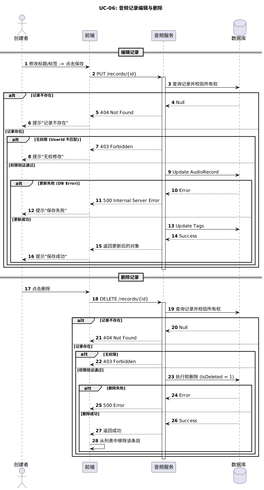

---

#### **（6）收藏跳转流程**

**描述：**

* **对象：** User / Favorite / AudioRecord / Backend / Frontend
* **流程：**

  1. 用户在收藏列表点击音频。
  2. 前端请求后端获取点击音频的详细信息。
  3. 后端返回音频信息。
  4. 用户可查看对应音频详情。

**说明：**
实现从收藏列表到音频详细信息的无缝跳转。

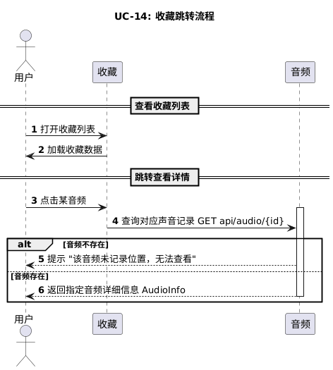

---

# **3 非功能需求（Non-functional Requirements）**

本节描述系统在性能、安全、灵活性、可维护性等方面的要求，用以确保系统稳定、可靠、易扩展，便于开发团队进行设计和实现。

---

## **3.1 性能要求（Performance Requirements）**

### **3.1.1 精度（Accuracy / Precision）**

* **GPS 精度**：系统中所有音频记录位置需保留经纬度 6 位小数（约 0.11 米精度），保证地图定位与附近记录查询精确。
* **音频转文本精度**：依赖第三方语音识别 API，要求普通话语音的文字识别正确率大于 90%，并尽量减少语义错误和断句错误。
* **LLM 辅助建议精度**：返回的音频主题分类、标题建议、情感倾向等结果，应尽量符合实际音频内容，保证用户可直接参考。
* **UI 显示精度**：地图显示、列表排序、热门推荐分数等应保持小数点后一位显示，避免四舍五入引起排名误差。

---

### **3.1.2 响应时间（Response Time / Latency）**

* **用户认证**：登录操作 ≤ 2 秒（包括前端提交、后端校验和 JWT 生成）。
* **首页加载**：热门推荐列表加载 ≤ 3 秒，保证用户访问首页时流畅。
* **音频上传**：单条音频（<50MB）上传至对象存储总时长 ≤ 8 秒，包括网络传输时间。
* **地图附近内容查询**：根据 GPS 坐标查询半径范围内记录，返回结果 ≤ 5 秒。
* **LLM 请求**：调用 LLM API 返回建议 ≤ 5 秒，以保证用户实时创建音频记录时体验顺畅。
* **操作反馈**：所有 CRUD 操作（创建/修改/删除记录、评论、收藏、点赞等）界面反馈 ≤ 2 秒。

**说明：** 系统应通过前端异步加载、后台缓存以及分页查询等技术优化响应速度。

---

### **3.1.3 输入/输出要求（I/O Requirements）**

#### **输入内容（Input）**

1. **音频文件**

   * **媒体格式**：MP3、WAV
   * **文件大小**：单条音频 ≤ 50MB，避免过大导致上传/存储延迟
   * **时长范围**：建议 5 秒–5 分钟
   * **录制精度**：采样率 ≥ 16 kHz，保证语音清晰
   * **示例**：用户录制一段 30 秒的普通话音频，保存为 WAV 格式，文件大小 2MB

2. **文本内容**

   * **类型**：用户输入的标题、描述、评论内容、标签文本
   * **编码**：UTF-8
   * **长度限制**：

     * 标题 ≤ 50 个字符
     * 描述 ≤ 500 个字符
     * 评论 ≤ 200 个字符
   * **校验要求**：禁止 HTML/JS 注入，禁止空文本提交
   * **示例**：用户为音频记录填写标题“埃菲尔铁塔夜景”，描述“傍晚拍摄的塔身灯光，微风轻拂”，UTF-8 编码

3. **GPS 经纬度**

   * **类型**：浮点数
   * **精度**：保留 6 位小数（约 0.11 米）
   * **范围**：

     * 纬度：-90 ~ +90
     * 经度：-180 ~ +180
   * **示例**：用户当前位置 48.858844, 2.294351（埃菲尔铁塔坐标）

4. **标签（Tag）**

   * **类型**：字符串
   * **长度**：≤ 20 个字符
   * **字符集**：支持中文、英文、数字
   * **规则**：禁止重复标签，自动去重
   * **示例**：用户为音频记录添加标签“旅行”“夜景”“巴黎”

---

#### **输出内容（Output）**

1. **JSON 数据**

   * **用户信息**：UserId、Nickname、AvatarUrl、注册时间
   * **音频记录**：RecordId、Title、Description、AudioUrl、TranscriptText、Tags、Latitude、Longitude、CreatedTime、UpdatedTime
   * **评论/点赞/收藏**：CommentId、UserId、Content、LikeCount、FavoriteCount
   * **推荐数据**：热门分数、排序权重、推荐算法标识
   * **示例**：

   ```json
   {
       "RecordId": "1001",
       "Title": "埃菲尔铁塔夜景",
       "AudioUrl": "https://oss.example.com/audio/1001.wav",
       "TranscriptText": "傍晚的埃菲尔铁塔，灯光璀璨...",
       "Tags": ["旅行", "夜景", "巴黎"],
       "Latitude": 48.858844,
       "Longitude": 2.294351,
       "CreatedTime": "2025-11-30T18:00:00Z",
       "UpdatedTime": "2025-11-30T18:05:00Z"
   }
   ```

2. **状态与错误反馈**

   * **HTTP 状态码**：200、201、400、401、403、404、500
   * **错误信息**：JSON 格式，包含 `code`、`message`
   * **示例**：

   ```json
   {
       "code": 400,
       "message": "音频文件大小超过限制 50MB"
   }
   ```

---

#### **输入输出校验与异常处理**

* 对输入进行格式和大小验证，超出限制或非法格式直接返回错误
* GPS 无效 → 返回错误，提示用户检查定位权限
* 音频上传失败 → 返回 HTTP 500 错误，并可重试
* 标签或文本为空 → 返回 400，提示用户填写必填字段
* 图片格式不合法或过大 → 返回 400，禁止上传

---

## **3.2 数据管理能力（Data Management Requirements）**

* **用户规模预测**：初期 1,000 用户，三年内预估约 30,000 用户。
* **数据生成速率**：每用户每天约 1–3 条音频记录。
* **音频存储**：对象存储容量 1–3 TB，支持横向扩展。
* **数据库设计**：采用 MySQL / PostgreSQL 分库分表策略，保证查询性能。
* **缓存策略**：Redis 用于存储热门权重、推荐分数，TTL 1–5 分钟，可快速响应热点数据。
* **备份与恢复**：

  * 冷备每日一次
  * 热备实时同步，保证关键数据可快速恢复
  * 音频文件与数据库分开备份，支持灾难恢复

**说明：** 数据管理方案保证系统在用户量增长和高并发下仍能稳定运行。

---

## **3.3 安全要求（Security Requirements）**

* **用户认证**：

  * 密码使用 bcrypt 哈希算法存储
  * JWT + Refresh Token 管理会话，保证安全访问
* **数据传输**：HTTPS 全站加密，保证通信安全
* **输入校验**：防止 SQL 注入、XSS、CSRF 攻击
* **访问控制**：用户只能操作自己权限范围内的资源
* **日志审计**：记录用户操作、异常事件，便于安全监控
* **API 限流**：防止恶意刷接口和 DDoS 攻击
* **异常处理**：系统错误或外部 API 异常需安全捕获，并提供友好提示

---

## **3.4 灵活性（Flexibility / Extensibility）**

* 推荐系统算法可切换，包括简单加权评分、行为学习排序等
* 标签系统可扩展，支持新分类、合并或删除标签
* 音频识别和 LLM 服务可替换供应商，接口统一规范化
* 系统微服务化设计，可独立升级单个模块，不影响整体运行

---

## **3.5 其他专门要求（Other Requirements）**

* **可维护性**：代码分层明确（Controller-Service-DAO），微服务模块化
* **扩展性**：中间件可替换（如 MinIO ↔ 阿里云 OSS、Redis ↔ Memcached）
* **UI/UX**：支持深色模式、适配不同屏幕尺寸和分辨率
* **异常处理提示**：操作失败时提供清晰提示与恢复建议

---

# **4 运行环境规定（Operating Environment Requirements）**

## **4.1 设备要求（Hardware Requirements）**

* **移动端**：Android 8.0+，CPU 多核 ≥1.8GHz，RAM ≥4GB
* **PC 端**：Windows / macOS / Linux，Chrome 或 Edge 浏览器最新稳定版
* **必备外设**：

  * 麦克风（录音功能）
  * GPS 定位权限（地图与附近记录功能）
* **网络要求**：Wi-Fi 或 4G/5G 网络，保证音频上传与 API 调用稳定

---

## **4.2 支持软件（Software Requirements）**

* **前端开发**：Node.js 18+，Vue3 框架，Webpack / Vite 打包
* **后端开发**：JDK 17、Spring Boot 3.x、微服务架构
* **数据库**：MySQL 8.0，Redis 6+ 用于缓存和热点数据
* **容器化与部署**：Docker CE，Kubernetes（可选）
* **测试工具**：Postman、Jest、JUnit
* **版本管理**：Git

---

## **4.3 外部接口（External Interfaces）**

* **语音识别 API**：用于音频转文本、生成摘要与关键词
* **LLM 服务**：生成音频标题、情感分析、主题建议（如 OpenAI / DeepSeek）
* **地图 API**：高德地图 / 百度地图，支持地图显示、附近记录查询
* **对象存储 API**：阿里云 OSS / MinIO，用于音频文件存储和访问
* **通信协议与数据格式**：HTTP/HTTPS + JSON；接口返回统一格式，便于前端解析
