# 《声印（VoiceMark）》软件概要设计

## 0 修订历史：

| 修改日期   | 说明     | 审核人员                  | 批准日期   |
| ---------- | -------- | ------------------------- | ---------- |
| 2025-12-17 | 初次编写 | 韩一墨 古振 易铭骏 赵泽远 | 2025-12-19 |

## 1 引言：

### 1.1. 概要设计依据

* 需求规约和需求分析规约：概要设计依据需求分析规约和需求规约编写，严格遵守概要设计的设计理念。

* 技术选型：主要运行方式为 **Web 前端（Vue3） + 移动端适配 + Android 打包版本（WebView/Hybrid） + Java Spring Boot 微服务后端**。

### 1.2 参考资料

* ISO/IEC/IEEE 29148-2018 《系统与软件需求工程》
* IEEE 830-1998 《软件需求规格说明》
* Spring Boot 官方文档（[https://spring.io/projects/spring-boot）](https://spring.io/projects/spring-boot）)
* Vue.js 3 官方文档（[https://vuejs.org）](https://vuejs.org）)
* Redis 官方文档
* OpenAI API 文档
* 高德地图 Web API / 百度地图 Web API
* Android SDK 官方文档

### 1.3 假定和约束

**技术栈约束**

* 前端：Vue3 + Pinia + Vite
* 后端：Java 17 + Spring Boot + Spring Cloud 微服务结构
* 需要支持 Android 打包（WebView Hybrid）
* 数据库：MySQL
* 缓存：Redis

**业务约束**

* LLM 返回内容不持久化，仅作为即时建议
* 采用 Git + CI（GitHub Actions 或 GitLab CI）
* 线上沟通使用QQ或者微信群聊

**安全与合规性约束**

* 所有账号密码必须加密存储（bcrypt）
* 访问控制基于 JWT
* 所有接口使用 HTTPS

**开发期限**
* 预计开发1个半月，从2025年11月中旬起，至2026年1月初结束

## 2 概要设计
### 2.1 系统体系架构设计

总系统由多个子系统构成，包括：

* 登录子系统

* 声音管理子系统

* SSE子系统

* 用户信息子系统

* 社交行为子系统

* 通知子系统

* 通用子系统

* 用户画像子系统

* LLM子系统

各个系统负责各自领域的事务，作为微服务独立运行，通过指定接口相互通信，设计符合微服务理念，使总系统保持较好的可扩展性和可维护性。系统ACD图如下所示：

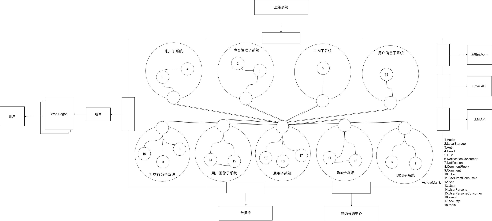

## 2.2 软件结构设计

软件的整体结构采用分层架构(Layered Architecture)，主要分为用户层、通信层、服务层和数据层。

### 2.2.1 用户层

用户层由Vue构建的Web页面组成，负责与用户进行实时交互。用户使用浏览器访问Web页面，通过用户层导航访问并操作各个服务的Web页面，如上传声音记录、查看个人信息等。

### 2.2.2 通信层

通信层使用HTTP作为通信协议，确保通信安全，ApiResponse作为通信内容的统一封装，确保通信能够被服务识别，JwtAuthenticationFilter用于认证授权，Spring Cloud Gateway用于请求路由、分发网关，确保请求被分发到正确的服务上。

### 2.2.3 服务层

登录子系统

* Auth:处理登录、登出、注册、找回密码等登录入口相关事务。

* Email:处理邮件发送事务。

声音管理子系统

* Audio:处理加载音频、上传音频等音频相关事务。

* LocalStorage:处理音频事务与数据库\资源中心的交互操作。

SSE推送子系统

* Sse:处理建立长连接，推送通知等事务。

* SseEventConsumer:负责监听事件，触发连接相关事件。

用户信息子系统

* User:负责获取、更新用户信息。

社交行为子系统

* CommentReply:负责查看回复、添加回复。
* Comment:负责获取评论、新增评论等基础评论事务。
* Like:负责点赞相关事务。

通知子系统

* Notification:负责查询通知相关事务。
* NotificationConsumer:负责根据事件通知相关数据库通信和触发推送。

LLM子系统

* LLM:负责调用外部LLM API，按照指定Prompt通信

用户画像子系统

* UserPersona:负责生成用户画像
* UserPersonaConsumer:负责根据事件触发生成用户画像

### 2.2.4 数据层

* 使用MySQL作为数据库，进行数据存储和管理。
* 使用单独的云服务器作为静态资源中心，可依据数据库路径查询相应资源，确保数据库的查询灵活性。

## 2.3 接口设计

### 2.3.1 前后端接口
GET /api/users/profile 获取当前用户profile

PUT /api/users/profile 提交当前用户profile

GET /api/users/{userId}/profile 查看公开用户{userId}profile

GET /api/users/favorites 获取当前用户的收藏列表

POST /api/users/favorites/{recordId} 添加收藏

DELETE /api/users/favorites/{recordId} 删除收藏

GET /api/users/settings 获取当前用户的设置

PUT /api/users/settings 更新当前用户的设置

POST /api/audio/upload 上传音频文件

POST /api/audio/{id}/publish 发布音频文件{id}

POST /api/audio/{id}/hide 隐藏\显示音频文件{id}

DELETE /api/audio/{id} 删除音频文件{id}

GET /api/audio/{id} 获取音频{id}详情

POST /api/audio/list 批量根据 id 列表返回多个音频

GET  /api/audio/nearby 根据当前位置返回附近音频信息

GET /api/audio/search 根据用户输入字段查找相关音频信息

GET /api/audio/recommendation 按照特定算法推荐一些音频

GET /api/audio/all/{userId} 获取当前用户上传的所有音频

POST /api/social/audio/comment/{audioId} 为指定音频添加评论并发布通知事件

GET /api/social/audio/comment/{audioId} 查询指定音频评论内容

POST /api/social/audio/reply/{commentId} 在评论下创建回复并发布通知

GET /api/social/audio/reply/{commentId} 查询指定评论的回复评论

DELETE /api/social/{type}/{id} 删除评论或回复

GET /api/social/audio/{audioId}/detail 返回指定音频的聚合详细信息（包含音频点赞数、当前用户是否点赞、评论与每个回复的点赞统计与用户是否点赞）

GET /api/social/comment/{commentId} 获取指定评论的详细信息

GET /api/social/reply/{replyId} 获取指定回复的详细信息

POST /api/social/audio/{audioId}/like 切换音频的点赞（若已点赞则取消，否则创建点赞记录），并在点赞时注册通知事件

POST /api/social/{type}/{id}/like 对评论点赞

GET /api/social/audio/{audioId}/like-status 查询音频点赞 count 或 exists

GET /api/social/{type}/{id}/like-status 查询特定type信息的 count 或 exists

POST /api/notifications/batch 获取当前用户的对应ID通知

GET /api/notifications/me 获取当前用户的通知

GET /api/notifications/read 将对应ID通知设定为已读

GET /api/sse/subscribe 为当前登录用户建立 SSE 长连接，在连接建立时推送尚未送达的通知

POST /api/llm/generate 提交询问内容，生成LLM响应

POST /api/llm/generateStream 提交询问内容，生成流式LLM响应

GET /api/llm/recommendation 获取LLM针对该用户的推荐

### 2.3.2 子系统内部接口

登录子系统

* Auth类调用Email类的sendSimpleMessage函数，参数{String to, String subject, String text}，无返回值。

声音管理子系统

* Audio类调用RemoteStorage类的uploadFile函数，参数{File file, String objectName}，返回值String。

* Audio类调用RemoteStorage类的deleteFile函数，参数{String url}，无返回值。

Sse推送子系统

* SseEventConsumer类调用Sse类的pushToUser函数，参数{Long userId, NotificationCreatedEvent event}，无返回值

通知子系统

* NotificationConsumer类将自己注册到通用子系统中，根据事件驱动，广播对应事件时调用handleNotificationEvent，参数{NotificationEvent event}，无返回值

## 2.4 界面设计

### 2.4.1 导航结构

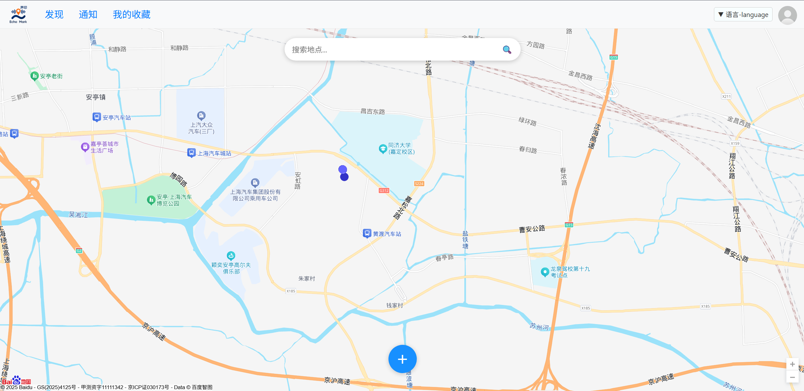

主页面顶部放置全局导航栏，从左到右依次为：主页面，发现，通知，收藏，语言切换，个人信息

### 2.4.2 功能设计

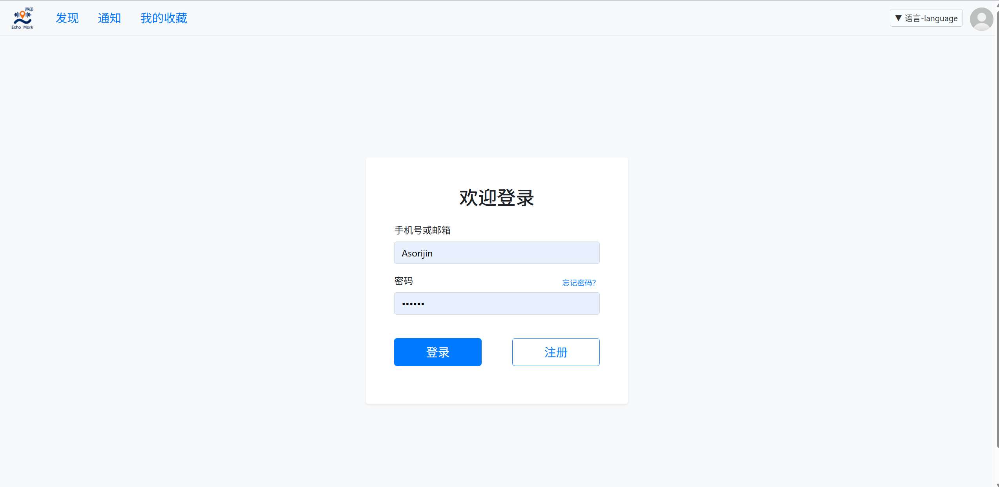

在登录前，任何试图跳转到其他页面的操作都会打开登录页面，要求用户登录后才可以使用其他功能

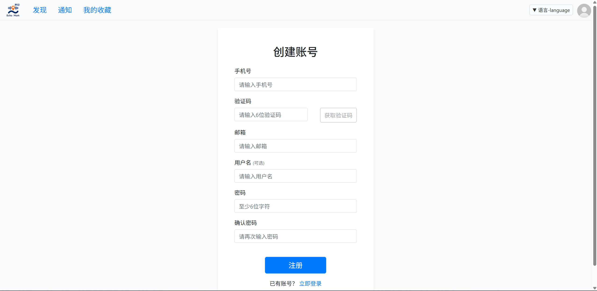

如果用户目前没有账户，可通过登录页面点击注册按钮跳转至注册页面，可以注册一个新的账号

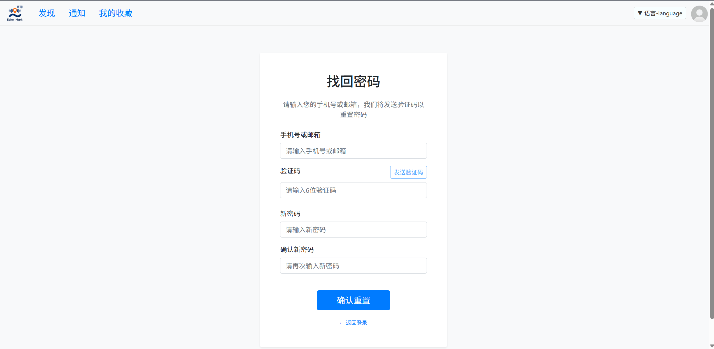

如果用户目前拥有账户，但是忘记密码，可以在登录页面点击忘记密码，跳转到找回密码页面，进行密码重置

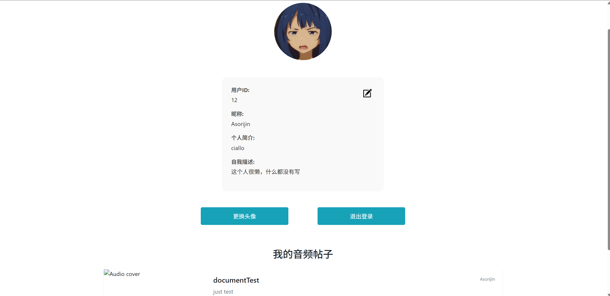

在登录后，点击导航栏中的个人信息图标，可以跳转到个人信息页面，展示账户的信息，在个人信息下方展示该账户发布的声音记录

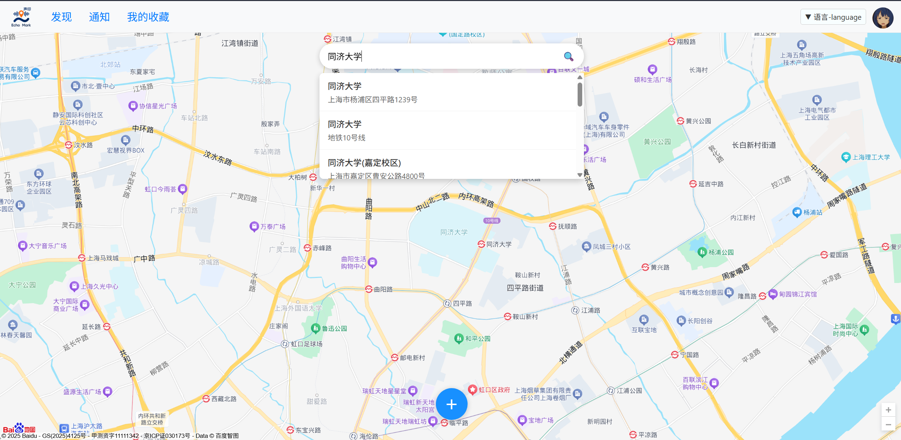

可以在主页面搜索指定的地点，跳转后会显示该地点附近的声音记录。

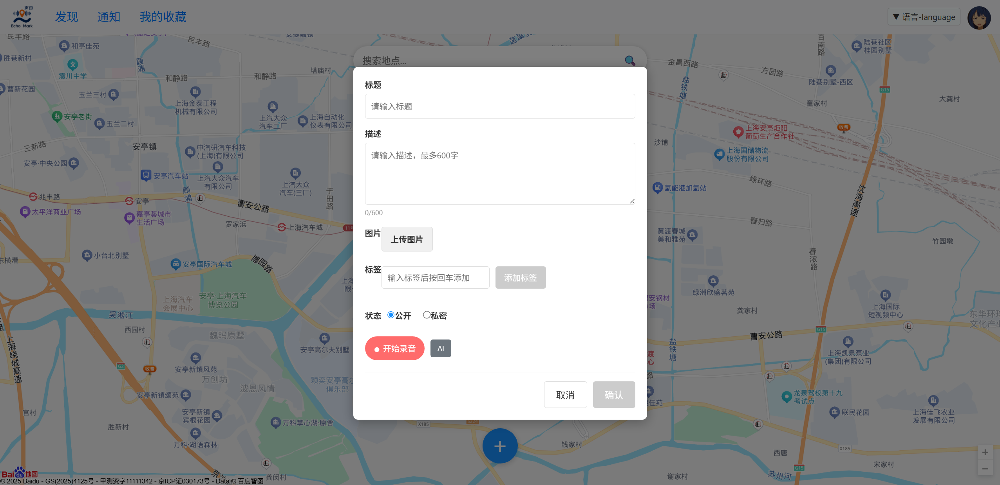

在主页面点击蓝色 “+” 按钮，唤起发布声音窗口，可以输入相关信息，上传想要上传的声音记录。录制声音后可以选择AI辅助，AI提供描述和标签的相关建议。

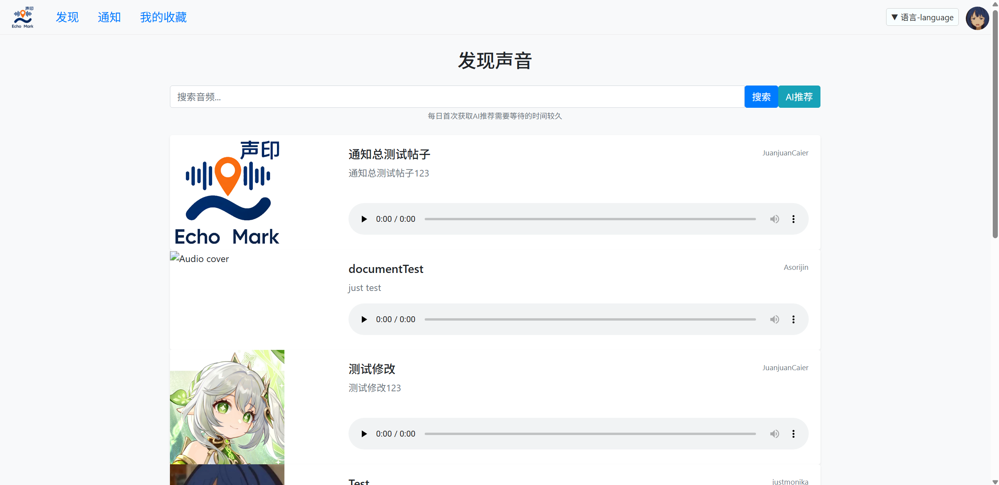

点击导航栏中的发现，跳转到发现页面，展示后台推荐的声音记录，可以根据输入检索声音记录。

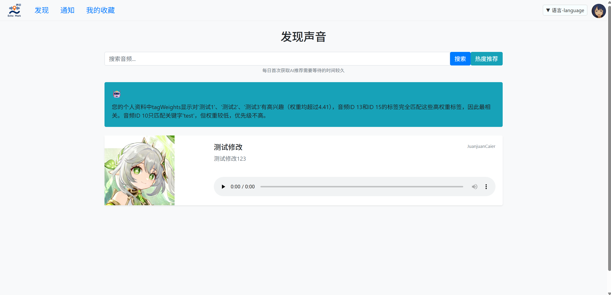

在发现页面中点击AI推荐，可获取AI根据用户画像得到的专属推荐，再次点击按钮可切换回后台默认推荐算法

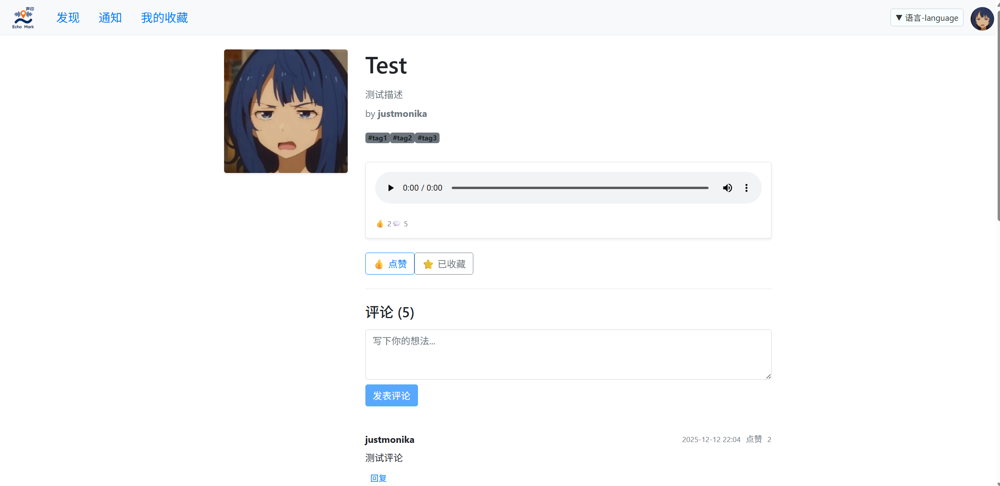

点击音频记录的概要展示，跳转到音频记录的详细信息页面，可以查看详细信息，也可以进行点赞、收藏、评论等操作

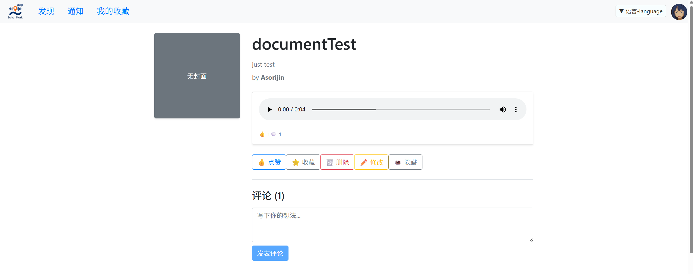

如果是当前账户发布的音频记录，还可以对自己的记录进行编辑、删除、隐藏等操作

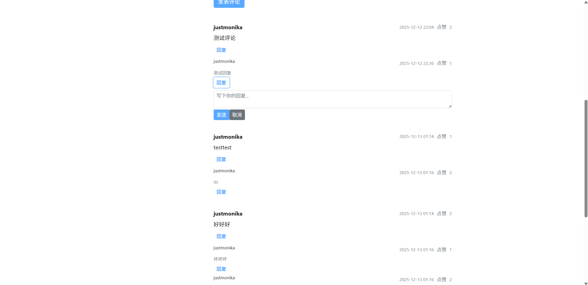

在音频记录详细信息页面的评论区可以进行评论该音频、回复评论、点赞评论、点赞回复操作

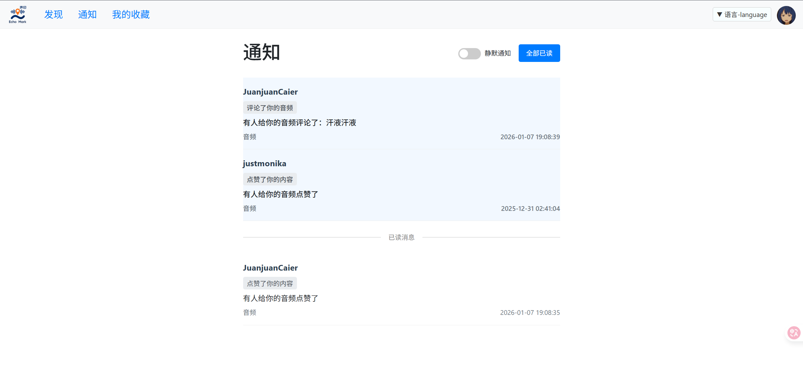

点击导航栏中的通知，跳转到通知页面，可以查看其他人和自己的互动，点击通知条目可以跳转到对应音频页面

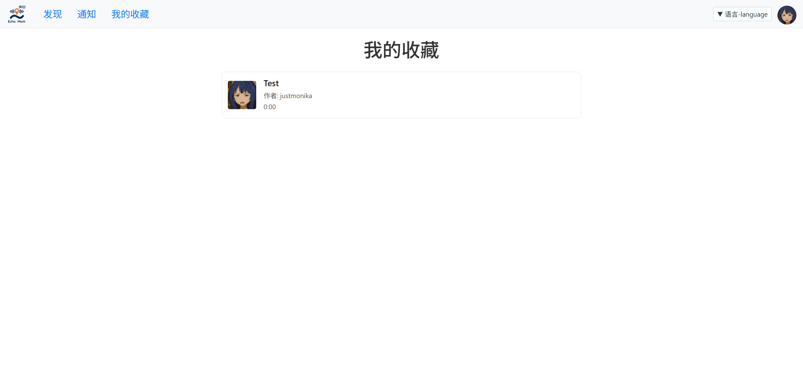

点击导航栏中的收藏，跳转到收藏页面，可以查看自己的收藏，点击收藏条目可以跳转到对应音频页面

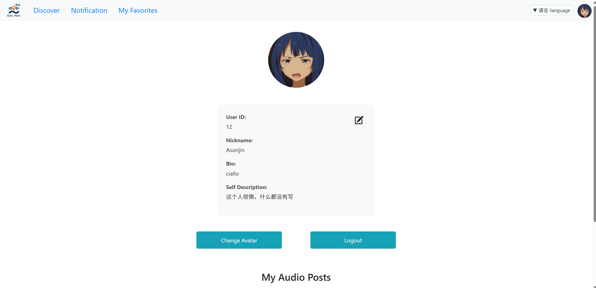

通过切换导航栏中的语言选项可以实现系统语言的语言切换，目前实现中英双语

## 2.5 外部接口设计

### 2.5.1 地图信息API

接口类型：REST API

数据格式：JSON

功能：获取地图信息、位置信息。

### 2.5.2 LLM API

接口类型：REST API

数据格式：JSON

功能：获取LLM的智能建议。

### 2.5.3 静态资源中心 API

接口类型：REST API

数据格式：Raw Binary

功能：对存储的静态资源进行操作。

### 2.5.4 Email API

接口类型：Spring本地服务接口

数据格式：String

功能：向用户发送邮件。

### 2.5.5 数据库 API

接口类型：Spring服务接口

数据格式：entity数据表

功能：存储对应的实体类信息

## 2.6 数据库设计

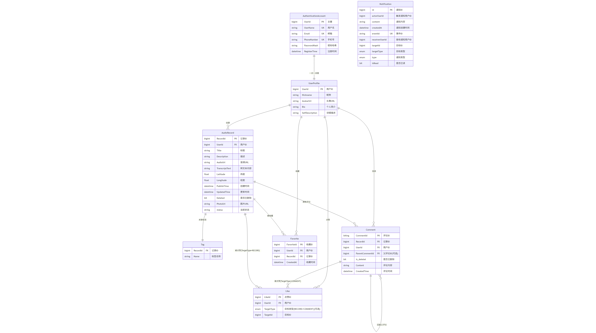

### 2.6.1 用户账户数据库

记录用户身份认证相关的信息。

* UserId:用户ID（bigint，主键）

* UserName:用户名（string，唯一键）

* Email:邮箱（string，唯一键）

* PhoneNumber:手机号（string，唯一键）

* PasswordHash:密码哈希（string）

* RegisterTime:注册时间（datetime）

### 2.6.2 用户信息数据库

记录用户身份信息。

* UserId:用户ID（bigint，主键）

* Nickname:昵称（string）

* AvatarUrl:头像URL（string）

* Bio:个人简介（string）

* SelfDescription:详细描述（string）

### 2.6.3 声音记录数据库

记录声音信息的详细属性。

* RecordId:记录ID（bigint，主键）

* UserId:用户ID（bigint，外键）

* Title:标题（string）

* Description:描述（string）

* AudioUrl:音频Url（string）

* TranscriptText:转录文本（string）

* Latitude:纬度（float）

* Longitude:经度（float）

* CreatedTime:创建时间（datetime）

* UpdatedTime:更新时间（datetime）

* Deleted:是否已删除（bit）

* PhotoUrl:图片Url（string）

* status:当前状态（string）

### 2.6.4 评论数据库

记录用户对音频记录的评论信息。

* CommentId:评论ID（bigint，主键）

* RecordId:记录ID（bigint，外键）

* UserId:用户ID（string，外键）

* ParentCommentId:父评论ID（bigint，外键）（可选）

* is_deleted:是否已删除（bit）

* Content:评论内容（string）

* CreatedTime:评论时间（datetime）

### 2.6.5 标签数据库

记录音频记录的标签信息。

* RecordId:记录ID（bigint，外键）

* Name:标签名称（string）

### 2.6.6 收藏数据库

记录用户收藏的音频记录信息。

* FavoriteId:收藏ID（bigint，主键）

* UserId:用户ID（bigint，外键）

* RecordId:记录ID（bigint，外键）

* CreatedAt:收藏时间（datetime）

### 2.6.7 点赞数据库

记录用户点赞行为信息。

* LikedId:点赞ID（bigint，主键）

* UserId:用户ID（bigint，外键）

* TargetType:目标类型（enum，RECORD/COMMENT）

* TargetId:目标ID（bigint）

### 2.6.8 通知数据库

记录通知信息。

* id 通知ID（bigint，主键）  

* actorUserId 触发通知的用户 ID（bigint）
* receiverUserId 接收通知的用户 ID （bigint）
* type 通知类型（enum）
* targetId 通知所指向的目标对象 ID（bigint）
* targetType 目标类型，枚举值（enum）
* eventId 唯一事件 ID，用于去重或幂等处理（string，唯一键）
* content 通知内容摘要（string）
* createdAt 通知创建时间（datetime）
* isRead 是否已读，用于控制未读红点等交互状态（bit）

## 2.7 系统异常处理设计

### 2.7.1 异常信息

对于系统运行过程中可能出现的异常，将其整理为几个异常分类。

| 异常类型 | 异常信息 | 含义及处理方法 |
| ---------- | -------- | ------------------------- |
| 认证错误 | “未认证” | 当前行为未通过身份安全校验，需重新进行认证 |
| 用户信息错误 | “{info}被注册\已存在\错误” | 用户输入信息与数据处理逻辑冲突，需重新确认输入信息正确性 |
| 权限错误 | “{info}不可操作” | 当前用户不具有进行该操作的权限，用户只能执行被允许的操作 |
| 语法错误\参数异常 | “{info}不合法\不支持” | 当前参数或语法错误，需要重新提交请求 |
| 系统繁忙 | “系统繁忙，服务暂时不可用” | 系统无法及时处理请求，需要等待系统负载降低后再次提交请求 |
| 运行时错误 | 系统错误 | RunTimeException，系统内异常如内存溢出等 |
| 请求重复 | “请勿重复提交请求” | 当前正在处理该请求，不允许重复提交同一请求，等待请求处理完毕即可 |
| 请求过于频繁 | “请求过于频繁，请稍后再试” | 用户提交过于频繁，等待系统允许提交后重试 |
| 数据访问错误 | “{File}为空\未找到” | 请求资源不可见或未在指定路径中，需要重新校对请求路径 |

### 2.7.2 容灾措施

* 请求重复\请求过多：系统暂时拒绝新请求提交，直到系统判断允许接收

* 数据访问错误：暂存上传数据，等待下一次操作

* 链接断开：保留断开前系统状态，进行适当处理后再继续运行

### 2.7.3 维护设计

* 对各种异常采取尽量详尽的定义，处理错误时可精准定位报错点

* 系统抛出异常时输出日志，记录操作与异常报告，为后续维护提供凭据

* 对系统采取监控措施，各项指标出现异常时及时提醒维护人员

* 提供可读性高、内容详细的操作手册，降低维护成本
