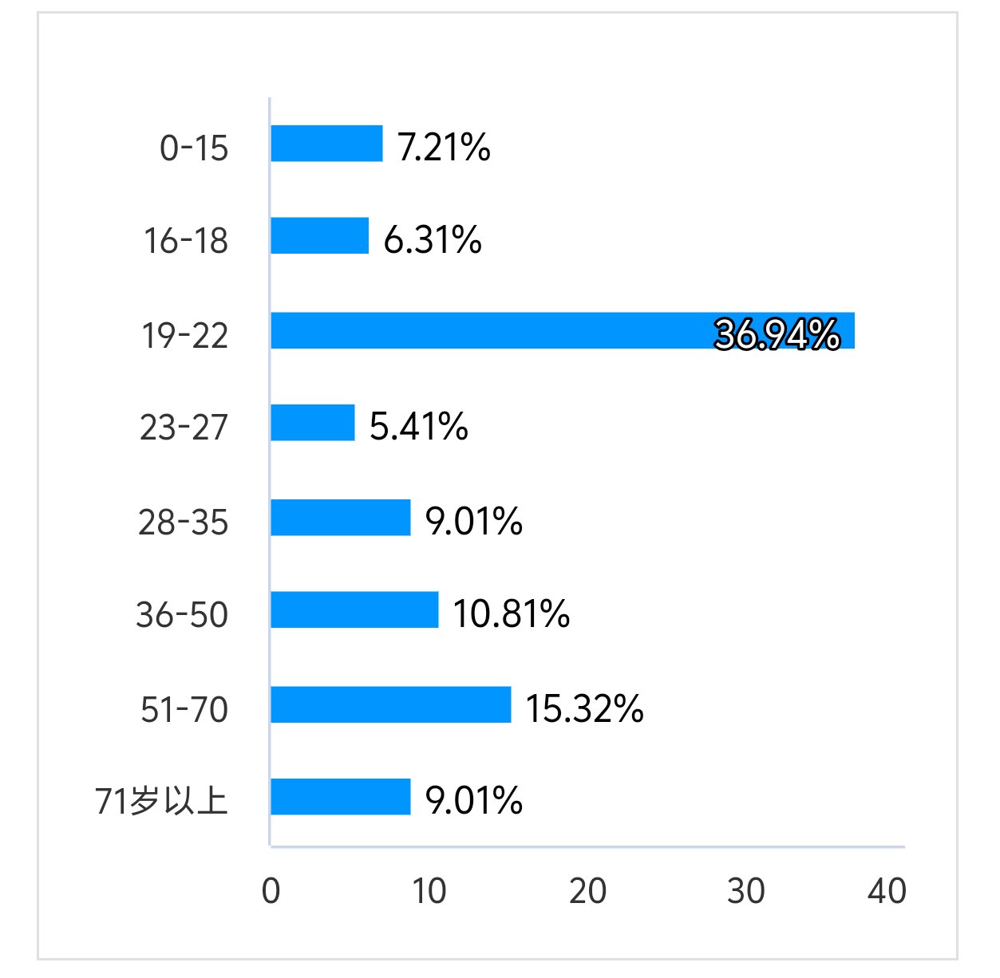
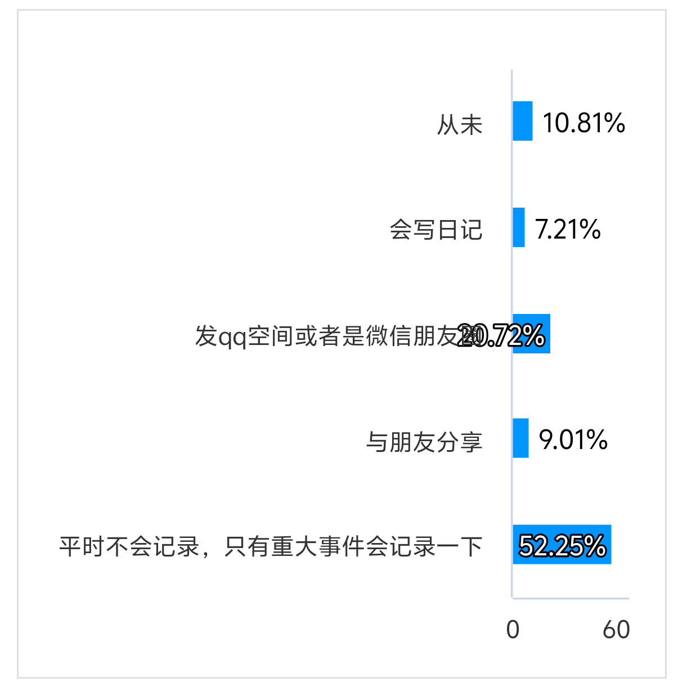
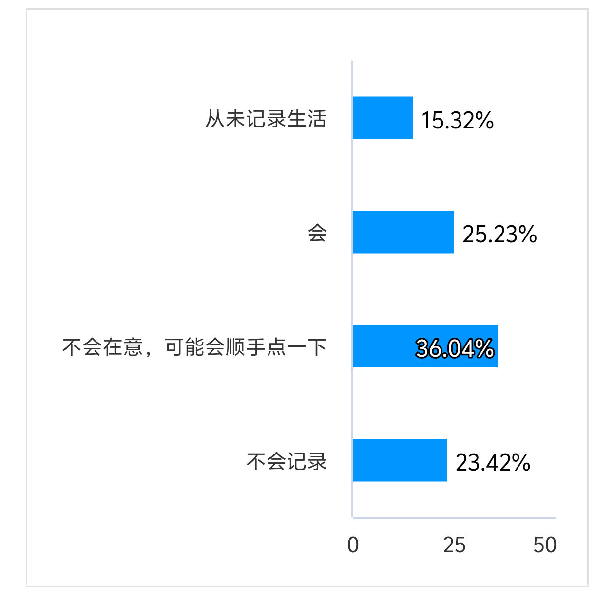
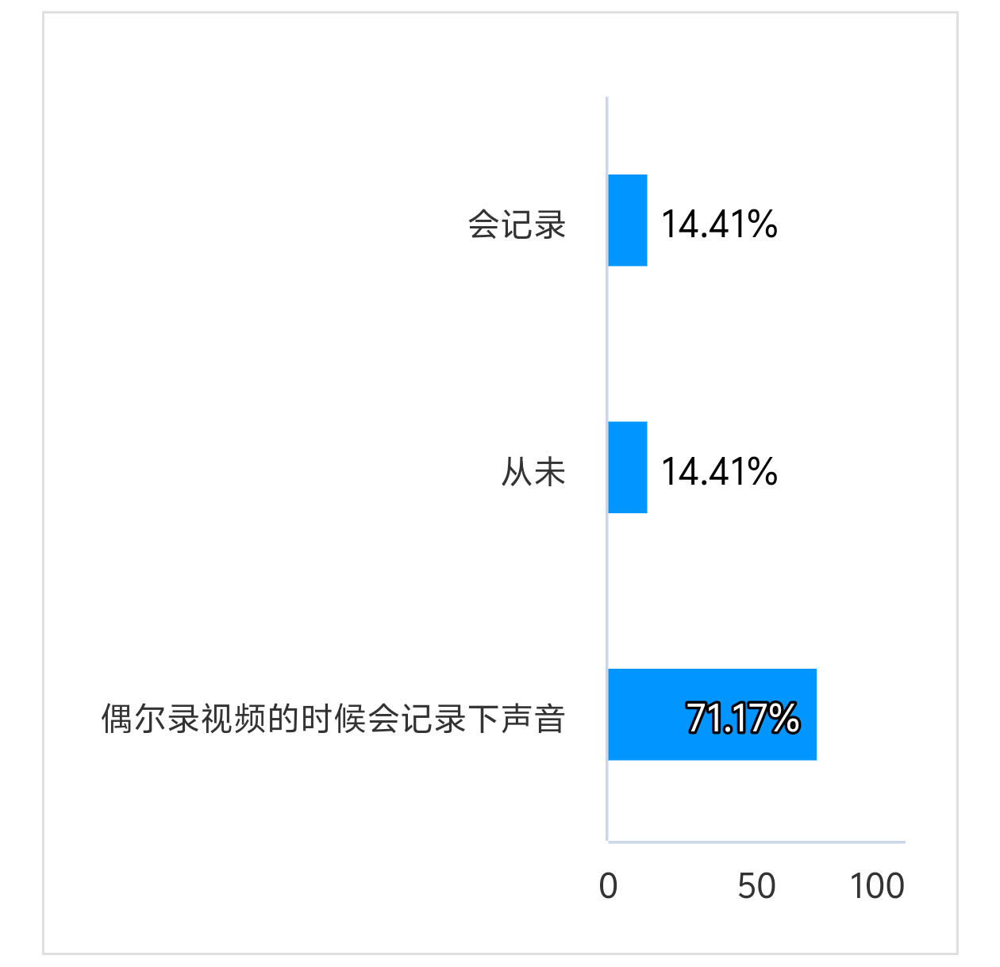
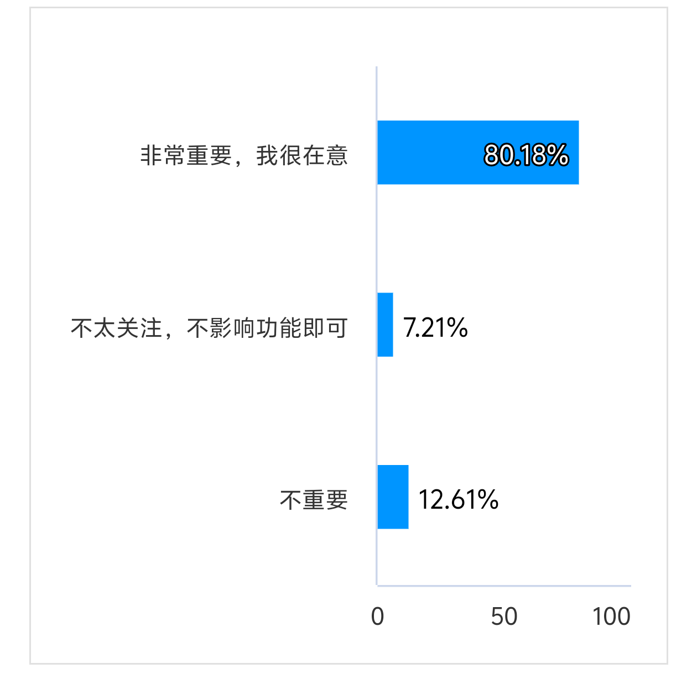
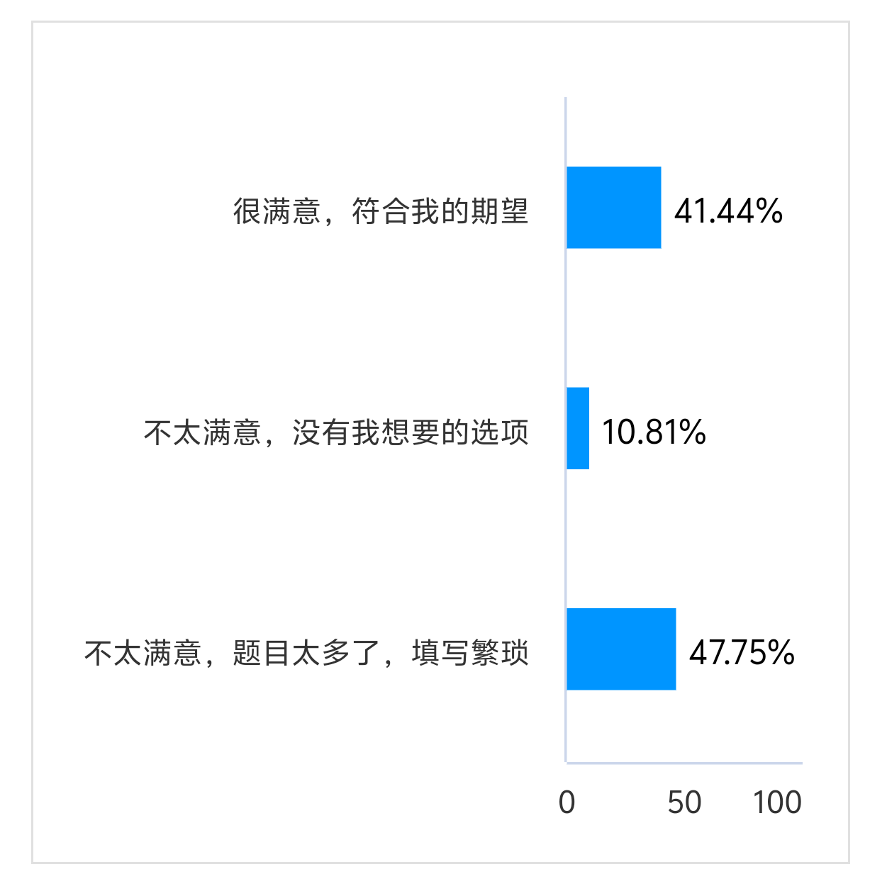
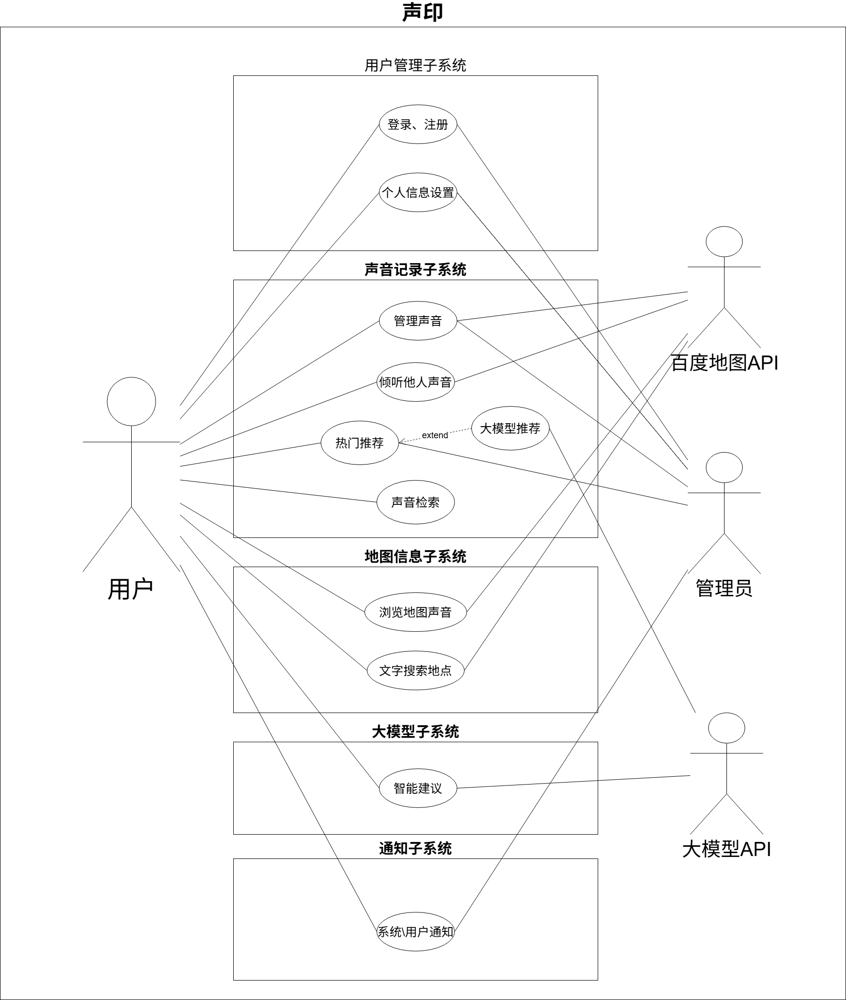
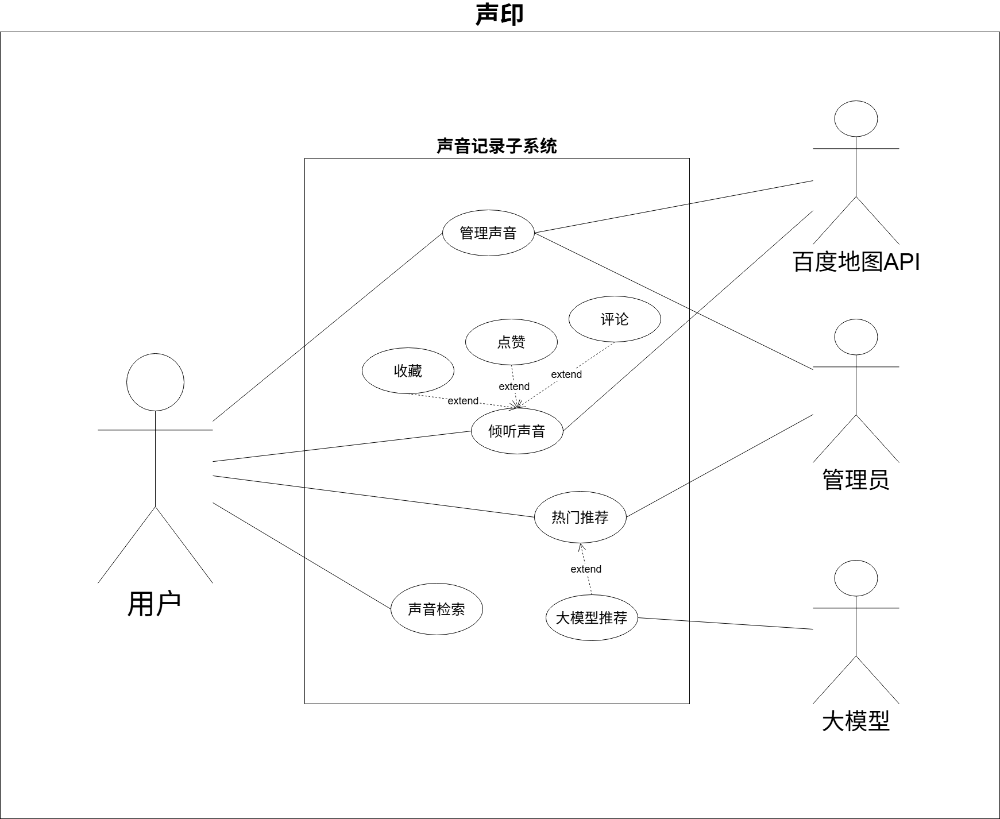
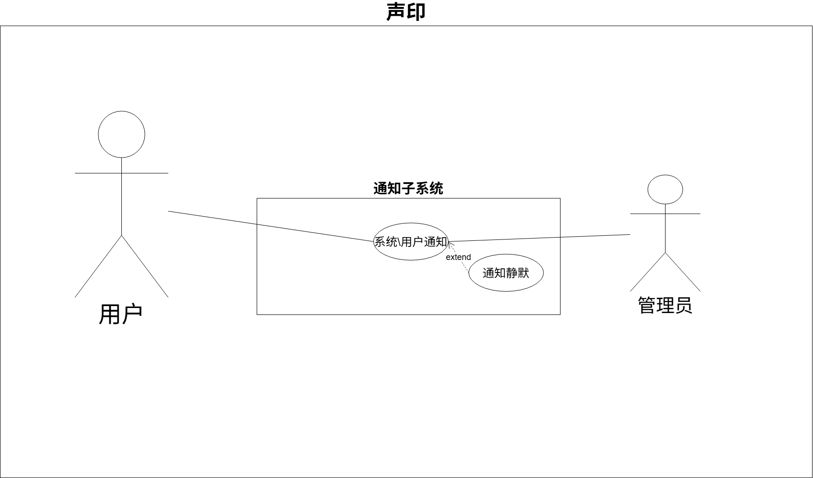

# 声印需求规约

## 0 修订历史：

| 修改日期   | 说明     | 审核人员                  | 批准日期   |
| ---------- | -------- | ------------------------- | ---------- |
| 2025-11-28 | 初次编写 | 韩一墨 古振 易铭骏 赵泽远 | 2025-12-1 |
| 2025-12-8  | 第二次编写| 韩一墨 古振 易铭骏 赵泽远 | 2025-12-9 |
## 1 介绍

本项目旨在开发一个基于地理位置与语音记忆的互动式网页平台——“声印”。用户可以通过上传语音并与地图位置关联，记录并分享生活中的声音记忆。随着人们对个性化、情感化内容记录需求的增长，传统的地图标记方式已难以满足用户对记忆形式多样化的追求。该平台通过整合语音录制、地图定位与社交分享功能，提供一种全新的记忆保存与探索方式。用户不仅可以在特定地点留下自己的声音印记，还可以浏览他人公开的语音片段，感受不同地方的声音故事。平台主界面为一张交互式大地图，用户可自由拖动、搜索地点，实现声音的时空探索与情感共鸣。

## 2 整体描述

### 2.1 项目特点

**情感化记忆载体：** 系统以语音为载体，将声音与地理位置绑定，形成具有情感温度和时空记忆的个性化内容，区别于传统图文记录方式。

**交互式地图体验：** 主界面是一张大地图，用户可自由拖动、缩放、搜索地点，直观查看和探索不同位置的声音印记。

**跨设备差异化支持：** 针对移动端与桌面端的使用场景差异，系统提供差异化功能支持：移动端支持语音上传与检索，桌面端专注于内容检索与播放，兼顾便捷性与体验完整性。

### 2.2 项目特色

**语音位置绑定：** 用户可在指定地理位置上传语音，系统自动将语音与地图坐标关联，形成“声音印记”。

**公开语音探索：** 用户可浏览他人公开的语音内容，通过地图交互发现不同地点的声音故事，增强探索性与社交性。

**地图驱动的内容检索：** 用户可通过搜索地名或拖动地图，快速定位并收听特定区域的声音，实现基于空间位置的语音内容发现。

### 2.3 运行环境

**前端运行平台：** 系统为响应式网页应用，支持主流浏览器。移动端用户可通过手机浏览器访问并使用完整功能，桌面端用户仅支持语音检索与播放，以加强声音与地理位置的强关联性。

**地图服务：** 所有地图功能（包括定位、搜索、标记、交互等）均通过集成百度地图 API 实现。

**语音处理与存储：** 系统支持主流音频格式的上传与播放，语音文件存储于云端，并关联用户及位置信息。

## 3 需求调研

### 3.1 调研内容

该问卷的题目设置为 5 个，主要目标对象为大学生和社会人士，问卷的问题概括如下：

1. 您的年龄？

2. 您平时会如何记录自己的生活？

3. 您在记录生活时会提起自己的位置吗？

4. 您是否想起过使用声音来记录美好的瞬间？

5. 您觉得公开您所有的声音记录合理吗？

6. 您是否觉得操作流程简单很重要？

7. 您是否期望一个 AI 助手来帮助您记录声音？

8. 您是否对使用声音和位置来记录日常的平台感兴趣？

9. 您对本问卷的满意程度？

### 3.2 调研结果

通过问卷调研，我们收集到了许多有用的需求。通过对于它们的综合分析，
我们总结出了以下的主要需求点：

- 网站需要能方便地上传声音。
- 网站需要有隐私系统，用户可以选择性公开记录。
- 网站需要操作简单，打开方便。
- 网站需要能搜索地点，以便于查看该地的声音。
- 网站需要可以给其他人的声音记录评论和点赞。
- 网站需要通过 AI 助手给用户提供建议，帮助用户进行声音的选择。

## 4 系统与其他系统的接口

### 4.1 地图显示接口

**功能：** 提供交互式地图展示与基础地图操作能力，包括地图初始化、缩放、拖动、标记点渲染及点击交互等。

**接口：** 百度地图 API。

**详细说明：**

- 用于在网页主界面加载并显示百度地图。
- 支持在地图上动态添加、删除和更新声音标记点。
- 支持地图事件监听（如点击地图任意位置、点击标记点等），以实现声音上传与播放的触发。
- 提供地图控件的自定义能力，如缩放控件、比例尺、地图类型切换等。

### 4.2 地名查询接口

**功能：** 支持通过关键词搜索地理位置，并返回对应的经纬度坐标与结构化地址信息。

**接口：** 百度地图地点搜索 API。

**详细说明：**

- 用户可在搜索框中输入地名（如“北京大学”、“西湖”），系统调用该接口获取匹配的地点列表。
- 返回结果包括地点名称、经纬度、所属区域等，用于地图定位与声音检索。

### 4.3 大语言模型接口

**功能：** 基于用户输入内容，提供智能建议等辅助能力。

**接口：** OpenAI GPT API 或国内等效大语言模型服务（如百度文心一言、讯飞星火等）。

**详细说明：**

- 根据用户输入的情景内容，输出建议，来帮助用户录制声音。例如，在用户试图分享一次愉快的享用甜筒的经历，但是却纠结于该说些什么时，可以询问智能助手获取建议：也许录制甜筒的“咔滋”声是更好的选择。

## 5 主要的功能需求描述

### 5.1 用户管理子系统

#### 5.1.1 登录/注册账号用例

**用例名称：** 登录/注册账号。+

**参与者：** 用户。

**前置条件：**

1. 用户已打开"声印"网页。
2. 用户设备连接互联网。

**后置条件：**

1. 用户成功登录，系统保存账号登录状态。
2. 用户可访问个性化功能和声音上传服务。

**基本事件流：**

1. 用户访问"声印"网页。
2. 系统检测未登录，右上角显示未登录头像。
3. 用户将鼠标置于头像上，显示下拉栏。
4. 用户点击登录/注册，进入登录/注册页面。
5. 用户登录/注册账号。
6. 系统获取用户基础信息（昵称、头像）。
7. 系统完成登录流程，更新界面显示用户信息。

**分支事件流：**

1. 注册用户

- 系统自动创建新用户账户。
- 返回主页。

2. 登录用户

- 系统获取账户信息。
- 返回主页。

3. 找回密码

- 点击忘记密码按钮。
- 在忘记密码页面向服务器申请重置密码。
- 返回登录\注册页面。

**异常事件流：**

1. 如果登录授权失败，系统提示"登录失败，请重试"。
2. 如果网络连接异常，系统提示"网络异常，请检查网络连接"。
3. 如果用户取消登录，系统返回未登录状态。
4. 如果用户找回密码的账户不存在，系统提示"账户不存在"。

#### 5.1.2 个人信息设置用例

**用例名称：** 个人信息设置。

**参与者：** 用户。

**前置条件：**

1. 用户已登录系统。

**后置条件：**

1. 用户的个人信息修改成功保存。
2. 系统界面实时更新显示修改后的信息。

**基本事件流：**

1. 用户鼠标置于页面右上角头像，选择下拉栏中的"个人中心"。
2. 系统显示个人信息页面（昵称、头像等）。
3. 用户修改个人信息。
4. 用户点击"保存"按钮。
5. 系统验证并保存修改内容。
6. 系统提示"修改成功"。

**分支事件流：**

1. 头像修改

- 用户点击头像区域，选择上传新头像。
- 系统支持裁剪和预览功能。

2. 昵称修改

- 用户点击昵称旁边的铅笔符号，输入新的昵称，确认更改。
- 将新昵称保存到数据库，前端显示更新为新的昵称。

**异常事件流：**

1. 如果保存失败，系统提示"保存失败，请重试"。
2. 如果头像文件过大，系统提示"图片大小超过限制"。

#### 5.1.3 退出登录用例

**用例名称：** 退出登录。

**参与者：** 用户。

**前置条件：**

1. 用户已登录系统。

**后置条件：**

1. 用户成功退出登录状态。
2. 清除本地账户数据和登录状态。

**基本事件流：**

1. 用户鼠标置于页面右上角头像，出现下拉栏。
2. 用户选择"退出登录"选项。
3. 系统弹出确认对话框。
4. 用户确认退出操作。
5. 系统清除本地登录状态和账户数据。
6. 系统跳转到未登录状态的主页面。

**分支事件流：**

1. 取消退出

- 用户在确认对话框选择取消，保持登录状态。

**异常事件流：**

1. 如果退出过程中发生网络错误，系统仍清除本地数据，提示"已退出登录"。

### 5.2 声音记录子系统

#### 5.2.1 管理声音用例

**用例名称：** 管理声音。

**参与者：** 用户。

**前置条件：**

1. 用户已登录系统。
2. 用户在移动端访问系统。
3. 用户已授予麦克风访问权限。

**后置条件：**

1. 声音文件成功上传并与地理位置关联。
2. 新的声音标记点显示在地图上。
3. 在本地和数据库删除需要删除的声音。
4. 删除的声音标记点在地图上删除。

**基本事件流：**

1. 用户在地图界面点击某个位置。
2. 系统弹出上传声音菜单。
3. 用户点击"录制声音"按钮。
4. 系统启动录音功能，显示录音界面和计时器。
5. 用户按住录音按钮开始录音（最长 60 秒）。
6. 用户松开按钮结束录音。
7. 系统播放录音预览，显示音频波形。
8. 用户确认上传，可选择设置隐私权限。
9. 用户可以添加描述和标签。
10. 系统将声音文件与地理位置信息关联并上传。
11. 系统在地图对应位置添加声音标记点。

**分支事件流：**

1. 录音取消

- 用户在录音过程中取消，系统不保存录音。

2. 重新录制

- 用户对预览不满意，可选择重新录制。

3. 添加描述

- 用户可为声音添加文字描述和标签。

4. 删除声音

- 用户可删除自己上传的声音。

**异常事件流：**

1. 如果麦克风权限未授权，系统提示"需要麦克风权限才能录音"。
2. 如果录音时间过短（< 3 秒），系统提示"录音时间太短"。
3. 如果上传失败，系统提示"上传失败，请重试"。

#### 5.2.2 倾听他人声音用例

**用例名称：** 倾听他人声音。

**参与者：** 用户。

**前置条件：**

1. 用户已进入地图界面。
2. 当前位置存在公开的声音记录。

**后置条件：**

1. 用户成功收听选定的声音记录。
2. 对当前记录的操作立刻使记录的相关信息发生相应的变化。

**基本事件流：**

1. 用户在地图上看到声音标记点。
2. 用户点击感兴趣的声音标记点。
3. 系统弹出声音信息卡片，显示声音基本信息（上传者、时间、点赞、评论）。
4. 用户点击"播放"按钮。
5. 系统加载并播放声音文件，显示播放进度。

**分支事件流：**

1. 评论

- 用户点击"评论"按钮。
- 用户输入想要评论的内容。
- 评论内容显示在这条记录的评论区中。

2. 点赞

- 用户点击"点赞"按钮。
- 图标变为已点赞状态。
- 这条记录的点赞数量+1。

3. 收藏

- 用户点击"收藏"按钮。
- 图标变为已收藏状态。
- 在用户的收藏中可找到这条记录。
- 这条记录的收藏数量+1。

4. 暂停/继续播放

- 用户在播放过程中可随时暂停和继续。

5. 进度控制

- 用户可拖动进度条控制播放位置。

6. 删除评论

- 用户点击评论右侧的更多信息按钮。
- 选择"删除评论"按钮。
- 评论被删除，在评论区中不可见。

7. 取消点赞

- 用户再次点击"点赞"按钮。
- 图标转换为未点赞状态。
- 这条记录的点赞数量-1.

8. 取消收藏

- 用户再次点击"收藏"按钮。
- 图标转换为未收藏状态。
- 从用户收藏中移除这条记录。
- 这条记录的收藏数量-1。

**异常事件流：**

1. 如果声音文件加载失败，系统提示"音频加载失败"。
2. 如果网络状况不佳，系统提示"网络不稳定，正在缓冲"。
3. 如果声音已被删除，系统提示"该声音已不存在"。
4. 如果评论内容包含敏感词，将会被审核删除。
5. 如果评论过于频繁，系统提示"操作过于频繁，请稍后再试"。
6. 如果操作失败，系统提示"操作失败，请重试"。

#### 5.2.3 声音检索用例

**用例名称：** 声音检索（标签检索）。

**参与者：** 用户。

**前置条件：**

1. 用户已进入系统主页面。
2. 系统内存在已标记的声音记录。

**后置条件：**

1. 用户成功检索到符合标签条件的声音记录。
2. 系统在地图上高亮显示匹配的声音标记点。

**基本事件流：**

1. 用户点击搜索框旁边的"标签筛选"按钮。
2. 系统显示热门标签列表和搜索输入框。
3. 用户输入标签关键词或选择现有标签。
4. 系统实时显示匹配的标签建议。
5. 用户确认选择检索标签。
6. 系统根据标签筛选声音记录。
7. 系统在地图上高亮显示匹配的声音标记点。
8. 系统在侧边栏显示匹配的声音列表。

**分支事件流：**

1. 多标签组合检索

- 用户可选择多个标签进行组合检索。
- 系统显示"且"和"或"两种逻辑关系选项。

2. 标签云展示

- 用户可直接点击标签云中的标签进行检索。

**异常事件流：**

1. 如果未找到匹配的标签，系统提示"未找到相关标签，请尝试其他关键词"。
2. 如果检索服务暂时不可用，系统提示"检索服务暂不可用，请稍后重试"。
3. 如果用户未选择任何标签，系统提示"请至少选择一个标签进行检索"。

#### 5.2.4 热门推荐用例

**用例名称：** 热门推荐。

**参与者：** 用户。

**前置条件：**

1. 用户已进入系统主页面。
2. 系统内存在一定数量的声音记录。

**后置条件：**

1. 用户成功获取并浏览系统推荐的热门声音记录。
2. 系统根据推荐算法更新推荐内容。

**基本事件流：**

1. 用户进入系统主页面。
2. 系统基于推荐算法（如基于热度、地理位置等）生成推荐声音列表。
3. 系统在推荐区域显示热门声音卡片，包含声音描述、上传者、播放次数、点赞数等信息。
4. 用户浏览推荐列表，可点击感兴趣的声音卡片。
5. 系统跳转到声音播放页面，加载并播放选中的声音。
6. 用户可对推荐的声音进行点赞、评论等互动操作。

**分支事件流：**

1. 基于地理位置的推荐

   - 系统优先推荐用户当前位置附近的热门声音。
   - 显示声音与用户的距离信息。

2. 刷新推荐内容

   - 用户可手动刷新推荐列表，获取最新热门内容。
   - 系统重新计算并更新推荐结果。

3. 大模型推荐

   - 用户可选择开启大模型推荐，获取大模型推荐的内容。

**异常事件流：**

1. 如果推荐算法服务不可用，系统显示默认热门列表（按播放量或点赞数排序）。
2. 如果用户所在区域无足够声音记录，系统扩展推荐范围至全国热门内容。
3. 如果推荐内容加载失败，系统提示"推荐加载失败，请重试"。
4. 如果用户为新用户且无历史行为数据，系统显示通用热门推荐列表。
5. 如果大模型服务不可用，则系统返回"大模型推荐暂不可用"。

### 5.3 地图信息子系统

#### 5.3.1 浏览地图用例

**用例名称：** 浏览地图。

**参与者：** 用户。

**前置条件：**

1. 用户已打开系统主页面。
2. 百度地图 API 加载成功。

**后置条件：**

1. 用户成功浏览不同区域的声音分布。
2. 地图显示更新到目标区域。

**基本事件流：**

1. 系统加载默认地图视图（用户当前位置或默认城市）。
2. 显示当前区域的声音标记点，不同密度区域使用聚合标记。
3. 用户通过手指拖动地图移动视图。
4. 系统实时更新地图显示区域。
5. 系统自动加载新区域的声音标记点。
6. 用户双指缩放调整地图级别。
7. 系统根据缩放级别动态调整标记点显示密度。

**分支事件流：**

1. 定位当前位置

- 用户点击定位按钮，系统居中显示用户当前位置并加载附近声音。

2. 标记点点击

- 用户点击标记点，系统显示声音预览信息。

3. 地图类型切换

- 用户可切换普通地图、卫星地图等显示模式。

**异常事件流：**

1. 如果地图加载失败，系统显示错误页面并提供重试选项。
2. 如果地理位置服务不可用，系统提示"定位服务不可用，使用默认位置"。
3. 如果网络中断，系统提示"网络连接已断开"。

#### 5.3.2 搜索地点用例

**用例名称：** 搜索地点。

**参与者：** 用户。

**前置条件：**

1. 用户已进入地图界面。
2. 地名查询服务可用。

**后置条件：**

1. 地图精确定位到搜索的目标地点。
2. 显示该地点附近的声音标记点。

**基本事件流：**

1. 用户点击顶部搜索框。
2. 用户输入地点关键词（如"西湖音乐喷泉"）。
3. 系统实时显示搜索建议列表。
4. 用户选择目标地点或直接确认搜索。
5. 系统调用地名查询接口获取精确坐标。
6. 系统将地图平滑移动并缩放到目标位置。
7. 系统加载并显示该位置附近的声音标记点。

**分支事件流：**

1. 模糊搜索

- 用户输入不完整地名，系统提供最可能的匹配结果。

**异常事件流：**

1. 如果搜索无结果，系统提示"未找到相关地点，请尝试其他关键词"。
2. 如果搜索服务不可用，系统提示"搜索服务暂不可用"。
3. 如果输入内容为空，系统提示"请输入搜索地点"。

### 5.4 大模型子系统

#### 5.4.1 智能建议用例

**用例名称：** 智能建议。

**参与者：** 用户。

**前置条件：**

1. 用户已登录系统。
2. 用户正在上传声音或准备录制。
3. 大语言模型服务可用。

**后置条件：**

1. 用户获得个性化的录音建议。
2. 用户根据建议调整录音内容或方式。

**基本事件流：**

1. 用户在上传声音界面点击"智能建议"按钮。
2. 系统弹出建议输入框。
3. 用户描述当前场景或想要表达的内容。
4. 用户点击"获取建议"按钮。
5. 系统调用大语言模型接口，发送用户描述和上下文信息。
6. 系统接收并显示 AI 生成的建议内容。
7. 用户阅读建议并决定是否采纳。

**分支事件流：**

1. 场景化建议

- 系统根据用户位置和时间提供场景化建议模板。

2. 多轮对话

- 用户可基于初始建议继续追问，获得更详细指导。

**异常事件流：**

1. 如果 AI 服务不可用，系统提示"智能助手暂不可用"。
2. 如果响应超时，系统提示"请求超时，请重试"。
3. 如果建议内容不合适，用户可点击"重新生成"。

### 5.5 通知子系统

#### 5.5.1 接收系统通知用例

**用例名称：** 接收系统通知。

**参与者：** 用户。

**前置条件：**

1. 用户已登录系统。
2. 用户有待处理的系统通知。

**后置条件：**

1. 用户成功查看系统通知内容。
2. 系统更新通知阅读状态。

**基本事件流：**

1. 系统检测到有待发送的系统通知（如昵称审核结果）。
2. 系统在页面右上角显示通知红点提示。
3. 用户点击通知图标进入通知中心。
4. 系统显示未读系统通知列表。
5. 用户点击某条系统通知查看详情。
6. 系统显示完整的通知内容及相关操作选项。
7. 系统将该通知标记为已读状态。

**分支事件流：**

1. 系统维护通知

- 系统提前发送维护计划通知。
- 用户可查看维护时间和影响范围。

2. 通知静默

- 用户进入通知界面。
- 在通知界面选择通知静默。
- 此后将不再提示有未读通知。

**异常事件流：**

1. 如果通知加载失败，系统提示"通知加载失败，请刷新页面重试"。
2. 如果网络连接中断，系统提示"网络连接异常，通知同步暂停"。
3. 如果通知内容异常，系统显示"通知内容暂不可用"。

#### 5.5.2 接收评论点赞通知用例

**用例名称：** 接收评论点赞通知。

**参与者：** 用户。

**前置条件：**

1. 用户已登录系统。
2. 其他用户对该用户的声音记录进行了互动（点赞、评论）。

**后置条件：**

1. 用户成功查看互动通知详情。
2. 系统更新通知阅读状态。

**基本事件流：**

1. 其他用户对用户的声音记录进行点赞或评论。
2. 系统生成相应的互动通知。
3. 系统在页面按钮右上角显示通知红点提示。
4. 用户点击通知图标进入通知中心。
5. 系统显示互动通知列表，包括点赞和评论信息。
6. 用户点击某条互动通知。
7. 系统跳转到对应的声音记录播放页面。
8. 系统将该通知标记为已读状态。

**分支事件流：**

1. 点赞通知

- 系统显示"XX 用户点赞了您的声音记录"。
- 显示点赞用户。

2. 评论通知

- 系统显示"XX 用户评论了您的语音记录"。
- 显示评论内容和时间戳。

3. 回复通知

- 当其他用户回复用户的评论时，生成回复通知。
- 显示回复内容和上下文。

4. 通知静默

- 用户进入通知界面。
- 在通知界面选择通知静默。
- 此后将不再提示有未读通知。

**异常事件流：**

1. 如果关联的声音记录已被删除，系统提示"该语音记录已不存在"。
2. 如果通知跳转失败，系统停留在通知列表页面并提示"跳转失败"。

## 6 非功能性需求描述

### 6.1 隐私需求

为保护用户声音内容与位置隐私，系统需建立完善的隐私保护机制，确保用户对个人数据拥有完全控制权。

**声音内容隐私：** 用户可自主设置每条声音记录的公开范围（公开、仅自己），未获授权的用户无法访问非公开内容。

**地理位置保护：** 系统应对精确坐标进行模糊处理，公开显示时仅展示大致区域，防止用户行踪轨迹被精准追踪。

**数据加密传输：** 所有语音文件及用户信息在传输过程中需进行加密处理，防止在传输链路中被窃取或篡改。

**权限分级管理：** 建立严格的权限控制系统，确保用户只能访问其权限范围内的数据和功能。

### 6.2 快捷性需求

为提升用户体验，系统应确保各项操作的响应速度，减少用户等待时间。

**语音上传优化：** 移动端语音上传流程应简化至 3 步以内完成，录音结束后自动触发上传流程。

**声音加载速度：** 声音文件的加载时间应控制在 2 秒以内，支持边加载边播放的流式传输。

**地图响应性能：** 地图缩放、拖动操作的响应延迟应低于 100 毫秒，确保交互流畅性。

**快速检索机制：** 地点搜索功能应在 1 秒内返回结果，支持输入过程中的实时建议。

### 6.3 可靠性需求

系统需具备高可用性及容错能力，确保服务的持续稳定运行。

**服务可用性：** 系统全年可用率不低于 99.5%，核心功能（地图展示、声音播放）在单点故障时仍能正常运行。

**数据持久化：** 用户上传的声音数据需进行多重备份，确保数据丢失率低于 0.01%。

**异常恢复：** 在网络中断或服务异常时，系统应提供适当的降级方案，如离线查看已缓存的声音记录。

**容错处理：** 对用户的不当操作（如重复点击、异常输入）应有相应的防护机制，避免系统崩溃。

### 6.4 性能需求

系统应满足多用户并发访问的需求，保证在高负载情况下的性能稳定。

**并发处理能力：** 系统需支持至少 1000 个用户同时在线访问，500 个用户并发进行声音播放操作。

**响应时间标准：** 页面加载时间不超过 3 秒，声音播放启动延迟控制在 1.5 秒以内。

**资源优化：** 对图片、音频等静态资源进行压缩和缓存，减少带宽占用，提升加载效率。

**数据库性能：** 数据库查询响应时间应保持在 100 毫秒以内，支持声音记录的高效检索和分类。

### 6.5 可用性需求

系统应提供直观易用的界面和操作流程，降低用户学习成本。

**界面一致性：** 保持整体设计风格统一，符合用户使用习惯，重要功能入口清晰明确。

**操作引导：** 为新用户提供简洁的操作指引，帮助用户快速了解核心功能的使用方法。

**无障碍访问：** 界面设计应考虑色盲、视力障碍用户的需求，提供足够的对比度和文字提示。

**多设备适配：** 确保在手机、平板、桌面等不同设备上均有良好的显示效果和操作体验。

### 6.6 可拓展性需求

系统架构应支持未来功能的扩展和用户规模的增长。

**模块化设计：** 各功能模块（用户管理、声音处理、地图服务）保持独立，支持单独升级和扩展。

**接口标准化：** 预留标准 API 接口，便于后续集成新的地图服务或语音处理功能。

**架构弹性：** 采用微服务架构，支持水平扩展，能够根据用户增长动态调整资源配置。

**技术前瞻性：** 在选择技术方案时考虑未来发展趋势，确保系统能够平滑过渡到新的技术平台。

## 7 其他需求

### 7.1 国外记录需求

为支持用户的跨国旅行记录需求，系统应具备国际化支持能力。

**多语言界面：** 提供英文界面选项，方便国际用户使用。

**全球地图覆盖：** 支持全球范围的地图显示和位置标记，确保用户在任何地区都能正常使用。

**时区自适应：** 系统自动识别用户所在时区，正确显示声音记录的时间信息。

### 7.2 完整文档体系

系统需提供全面的文档支持，确保项目的可维护性和可持续发展。

**技术文档：** 包含系统架构说明、API 接口文档、数据库设计文档等关键技术资料。

**用户手册：** 提供详细的功能使用说明和操作指南，帮助用户充分了解系统功能。

**维护文档：** 包含系统部署、监控、故障处理等运维相关文档。

**测试文档：** 提供完整的测试用例和测试报告，确保系统质量可控。

### 7.3 用户反馈与更新迭代

建立完善的用户反馈机制和产品迭代流程，持续优化系统功能。

**反馈渠道：** 在系统内设置便捷的反馈入口，支持用户提交使用建议和问题报告。

**需求收集：** 定期分析用户反馈数据，识别共性需求和改进方向。

**版本规划：** 制定清晰的版本发布计划，确保系统功能的有序迭代和优化。

**质量监控：** 建立产品质量监控体系，跟踪系统稳定性、用户满意度等关键指标。
